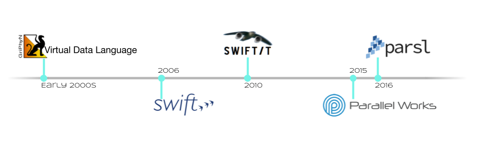

Roadmap
=======

Before diving into the roadmap, a quick retrospective look at the evolution of workflow
solutions that came before Parsl from the workflows group at UChicago and Argonne National Laboratory.

Sufficient capabilities to use Parsl in many common situations already exist.  This document indicates where Parsl is going;
it contains a list of features that Parsl has or will have.  Features that exist today are marked in bold, with the release
in which they were added marked for releases since 0.3.0. Help in providing any of the yet-to-be-developed capabilities is welcome.

The upcoming release is Parsl-0.8.0 and features in preparation are documented via Github
`issues <https://github.com/Parsl/parsl/issues>`_ and `milestones <https://github.com/Parsl/parsl/milestone/7>`_.

Core Functionality
---------------------

* **Parsl has the ability to execute standard python code and to asynchronously execute tasks, called Apps.**
    * **Any Python function annotated with "@App" is an App.**
    * **Apps can be Python functions or bash scripts that wrap external applications.**
* **Asynchronous tasks return futures, which other tasks can use as inputs.**
    * **This builds an implicit data flow graph.**
* **Asynchronous tasks can execute locally on threads or as separate processes.**
* **Asynchronous tasks can execute on a remote resource.**
    * **libsubmit (to be renamed) provides this functionality.**
    * **A shared filesystem is assumed; data staging (of files) is not yet supported.**
* **The Data Flow Kernel (DFK) schedules Parsl task execution (based on dataflow).**
* **Class-based config definition (v0.6.0)**
* **Singleton config, and separate DFK from app definitions (v0.6.0)**
* Class-based app definition

Data management
---------------

* **File abstraction to support representation of local and remote files.**
* **Support for a variety of common data access protocols (e.g., FTP, HTTP, Globus) (v0.6.0)**.
* **Input/output staging models that support transparent movement of data from source to a location on which it is accessible for compute. This includes staging to/from the client (script execution location) and worker node (v0.6.0)**.
* Support for creation of a sandbox and execution within the sandbox.
* Multi-site support including transparent movement between sites.
* Support for systems without a shared file system (point-to-point staging).
* Support for data caching at multiple levels and across sites.

.. todo::
   Add diagram for staging

Execution core and parallelism (DFK)
------------------------------------

* **Support for application and data futures within scripts.**
* **Internal (dynamically created/updated) task/data dependency graph that enables asynchronous execution ordered by data dependencies and throttled by resource limits.**
* **Well-defined state transition model for task lifecycle. (v0.5.0)**
* Add data staging to task state transition model.
* **More efficient algorithms for managing dependency resolution. (v0.7.0)**
* Scheduling and allocation algorithms that determine job placement based on job and data requirements (including deadlines) as well as site capabilities.
* **Directing jobs to a specific set of sites.(v0.4.0)**
* **Logic to manage (provision, resize) execution resource block based on job requirements, and running multiple tasks per resource block (v0.4.0).**
* **Retry logic to support recovery and fault tolerance**
* **Workflow level checkpointing and restart (v0.4.0)**
* **Transition away from IPP to in-house executors (HighThroughputExecutor and ExtremeScaleExecutor v0.7.0)**

Resource provisioning and execution
-----------------------------------

* **Uniform abstraction for execution resources (to support resource provisioning, job submission, allocation management) on cluster, cloud, and supercomputing resources**
* **Support for different execution models on any execution provider (e.g., pilot jobs using Ipython parallel on clusters and extreme-scale execution using Swift/T on supercomputers)**
    * **Slurm**
    * **HTCondor**
    * **Cobalt**
    * **GridEngine**
    * **PBS/Torque**
    * **AWS**
    * **GoogleCloud**
    * Azure
    * **Nova/OpenStack/Jetstream (partial support)**
    * **Kubernetes (v0.6.0)**
* **Support for launcher mechanisms**
    * **srun**
    * **aprun (Complete support 0.6.0)**    
    * Various MPI launch mechanisms (Mpiexec, mpirun..)
* Support for remote execution using **SSH** and OAuth-based authentication (SSH execution support added in 0.3.0)
* **Utilizing multiple sites for a single script’s execution (v0.4.0)**
* Cloud-hosted site configuration repository that stores configurations for resource authentication, data staging, and job submission endpoints
* **IPP workers to support multiple threads of execution per node. (v0.7.0 adds support via replacement executors)**
* Smarter serialization with caching frequently used objects.
* **Support for user-defined containers as Parsl apps and orchestration of workflows comprised of containers (v0.5.0)**
    * **Docker (locally)**
    * Shifter (NERSC, Blue Waters)
    * Singularity (ALCF)

Visualization, debugging, fault tolerance
-----------------------------------------

* **Support for exception handling**.
* **Interface for accessing real-time state (v0.6.0)**.
* Visualization library that enables users to introspect graph, task, and data dependencies, as well as observe state of executed/executing tasks
* Integration of visualization into jupyter
* Support for visualizing dead/dying parts of the task graph and retrying with updates to the task.
* **Retry model to selectively re-execute only the failed branches of a workflow graph**
* **Fault tolerance support for individual task execution**
* **Support for saving monitoring information to local DB (sqlite) and remote DB (elasticsearch) (v0.6.0 and v0.7.0)**

Authentication and authorization
--------------------------------

* **Seamless authentication using OAuth-based methods within Parsl scripts (e.g., native app grants) (v0.6.0)**
* Support for arbitrary identity providers and pass through to execution resources
* Support for transparent/scoped access to external services **(e.g., Globus transfer) (v0.6.0)**

Ecosystem
---------

* Support for CWL, ability to execute CWL workflows and use CWL app descriptions
* Creation of library of Parsl apps and workflows
* Provenance capture/export in standard formats
* Automatic metrics capture and reporting to understand Parsl usage
* **Anonymous Usage Tracking (v0.4.0)**

Documentation / Tutorials:
--------------------------

* **Documentation about Parsl and its features**
* **Documentation about supported sites (v0.6.0)**
* **Self-guided Jupyter notebook tutorials on Parsl features**
* **Hands-on tutorial suitable for webinars and meetings**

