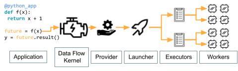

Quickstart
==========

To try Parsl now (without installing any code locally), experiment with our 
`hosted tutorial notebooks on Binder <https://mybinder.org/v2/gh/Parsl/parsl-tutorial/master>`_.

Installation
------------

Parsl is available on `PyPI <https://pypi.org/project/parsl/>`_ and `conda-forge <https://anaconda.org/conda-forge/parsl>`_. 

Parsl requires Python3.10+ and has been tested on Linux.

Installation using Pip
^^^^^^^^^^^^^^^^^^^^^^

While ``pip`` can be used to install Parsl, we suggest the following approach
for reliable installation when many Python environments are available.

1. Install Parsl::

     $ python3 -m pip install parsl

To update a previously installed parsl to a newer version, use: ``python3 -m pip install -U parsl``

Installation using Conda
^^^^^^^^^^^^^^^^^^^^^^^^

1. Create and activate a new conda environment::

     $ conda create --name parsl_py310 python=3.10
     $ source activate parsl_py310

2. Install Parsl::

     $ python3 -m pip install parsl

     or

     $ conda config --add channels conda-forge
     $ conda install parsl

The conda documentation provides `instructions <https://docs.conda.io/projects/conda/en/latest/user-guide/install/>`_ for installing conda on macOS and Linux. 

Getting started
---------------

Parsl has much in common with Python's native concurrency library,
but unlocking Parsl's potential requires understanding a few major concepts.

A Parsl program submits tasks to run on Workers distributed across remote computers.
The instructions for these tasks are contained within `"apps" <#application-types>`_
that users define using Python functions.
Each remote computer (e.g., a node on a supercomputer) has a single `"Executor" <#executors>`_
which manages the workers.
Remote resources available to Parsl are acquired by a `"Provider" <#execution-providers>`_,
which places the executor on a system with a `"Launcher" <#launchers>`_.
Task execution is brokered by a `"Data Flow Kernel" <#benefits-of-a-data-flow-kernel>`_ that runs on your local system.

We describe these components briefly here, and link to more details in the `User Guide <userguide/index.html>`_.

.. note::

    Parsl's documentation includes `templates for many supercomputers <userguide/configuring/examples.html>`_.
    Even though you may not need to write a configuration from a blank slate,
    understanding the basic terminology below will be very useful.

Application Types
^^^^^^^^^^^^^^^^^

Parsl enables concurrent execution of Python functions (``python_app``)
or external applications (``bash_app``).
The logic for both are described by Python functions marked with Parsl decorators.
When decorated functions are invoked, they run asynchronously on other resources.
The result of a call to a Parsl app is an :class:`~parsl.app.futures.AppFuture`,
which behaves like a Python Future.

The following example shows how to write a simple Parsl program
with hello world Python and Bash apps.

.. code-block:: python

    import parsl
    from parsl import python_app, bash_app

    @python_app
    def hello_python (message):
        return 'Hello %s' % message

    @bash_app
    def hello_bash(message, stdout='hello-stdout'):
        return 'echo "Hello %s"' % message

    
    with parsl.load():
        # invoke the Python app and print the result
        print(hello_python('World (Python)').result())

        # invoke the Bash app and read the result from a file
        hello_bash('World (Bash)').result()

    with open('hello-stdout', 'r') as f:
        print(f.read())

Learn more about the types of Apps and their options `here <userguide/apps/index.html>`__.

Executors
^^^^^^^^^

Executors define how Parsl deploys work on a computer.
Many types are available, each with different advantages.

The :class:`~parsl.executors.high_throughput.executor.HighThroughputExecutor`,
like Python's ``ProcessPoolExecutor``, creates workers that are separate Python processes.
However, you have much more control over how the work is deployed.
You can dynamically set the number of workers based on available memory and
pin each worker to specific GPUs or CPU cores
among other powerful features.

Learn more about Executors `here <userguide/configuration/execution.html#executors>`__.

Execution Providers
^^^^^^^^^^^^^^^^^^^

Resource providers allow Parsl to gain access to computing power.
For supercomputers, gaining resources often requires requesting them from a scheduler (e.g., Slurm).
Parsl Providers write the requests to requisition **"Blocks"** (e.g., supercomputer nodes) on your behalf.
Parsl comes pre-packaged with Providers compatible with most supercomputers and some cloud computing services.

Another key role of Providers is defining how to start an Executor on a remote computer.
Often, this simply involves specifying the correct Python environment and
(described below) how to launch the Executor on each acquired computers.

Learn more about Providers `here <userguide/configuration/execution.html#execution-providers>`__.

Launchers
^^^^^^^^^

The Launcher defines how to spread workers across all nodes available in a Block.
A common example is an :class:`~parsl.launchers.launchers.MPILauncher`, which uses MPI's mechanism
for starting a single program on multiple computing nodes.
Like Providers, Parsl comes packaged with Launchers for most supercomputers and clouds.

Learn more about Launchers `here <userguide/configuration/execution.html#launchers>`__.

Benefits of a Data-Flow Kernel
^^^^^^^^^^^^^^^^^^^^^^^^^^^^^^

The Data-Flow Kernel (DFK) is the behind-the-scenes engine behind Parsl.
The DFK determines when tasks can be started and sends them to open resources,
receives results, restarts failed tasks, propagates errors to dependent tasks,
and performs the many other functions needed to execute complex workflows.
The flexibility and performance of the DFK enables applications with
intricate dependencies between tasks to execute on thousands of parallel workers.

Start with the Tutorial or the `parallel patterns <userguide/workflows/workflow.html>`_
to see the complex types of workflows you can make with Parsl.

Starting Parsl
^^^^^^^^^^^^^^

A Parsl script must contain the function definitions, resource configuration, and a call to ``parsl.load``
before launching tasks.
This script runs on a system that must stay on-line until all of your tasks complete but need not have
much computing power, such as the login node for a supercomputer.

The :class:`~parsl.config.Config` object holds definitions of Executors and the Providers and Launchers they rely on.
An example which launches 4 workers on 1 node of the Polaris supercomputer looks like

.. code-block:: python

    from parsl import Config
    from parsl.executors import HighThroughputExecutor
    from parsl.providers import PBSProProvider
    from parsl.launchers import MpiExecLauncher

    config = Config(
        retries=1,  # Restart task if they fail once
        executors=[
            HighThroughputExecutor(
                available_accelerators=4,  # Maps one worker per GPU
                address=address_by_hostname(),
                cpu_affinity="alternating",  # Prevents thread contention
                provider=PBSProProvider(
                    account="example",
                    worker_init="module load conda; conda activate parsl",
                    walltime="1:00:00",
                    queue="debug",
                    scheduler_options="#PBS -l filesystems=home:eagle",  # Change if data on other filesystem
                    launcher=MpiExecLauncher(
                        bind_cmd="--cpu-bind", overrides="--depth=64 --ppn 1"
                    ),  # Ensures 1 manger per node and allows it to divide work to all 64 cores
                    select_options="ngpus=4",
                    nodes_per_block=1,
                    cpus_per_node=64,
                ),
            ),
        ]
    )

The documentation has examples for other supercomputers `here <userguide/configuration/examples.html>`_.

The next step is to load the configuration

.. code-block:: python

    parsl.load(config)

You are then ready to use 10 PFLOPS of computing power through Python!

Tutorial
--------

The best way to learn more about Parsl is by reviewing the Parsl tutorials.
There are several options for following the tutorial: 

1. Use `Binder <https://mybinder.org/v2/gh/Parsl/parsl-tutorial/master>`_  to follow the tutorial online without installing or writing any code locally. 
2. Clone the `Parsl tutorial repository <https://github.com/Parsl/parsl-tutorial>`_ using a local Parsl installation.
3. Read through the online `tutorial documentation <1-parsl-introduction.html>`_.

Usage Tracking
--------------

To help support the Parsl project, we ask that users opt-in to anonymized usage tracking
whenever possible. Usage tracking allows us to measure usage, identify bugs, and improve
usability, reliability, and performance. Only aggregate usage statistics will be used
for reporting purposes. 

As an NSF-funded project, our ability to track usage metrics is important for continued funding. 

You can opt-in by setting ``usage_tracking=3`` in the configuration object (`parsl.config.Config`). 

To read more about what information is collected and how it is used see :ref:`label-usage-tracking`.

For Developers
--------------

Parsl is an open source community that encourages contributions from users
and developers. A guide for `contributing <https://github.com/Parsl/parsl/blob/master/CONTRIBUTING.rst>`_ 
to Parsl is available in the `Parsl GitHub repository <https://github.com/Parsl/parsl>`_.

The following instructions outline how to set up Parsl from source.

1. Download Parsl::

    $ git clone https://github.com/Parsl/parsl

2. Install::

    $ cd parsl
    $ pip install .
    ( To install specific extra options from the source :)
    $ pip install '.[<optional_package1>...]'

3. Use Parsl!

