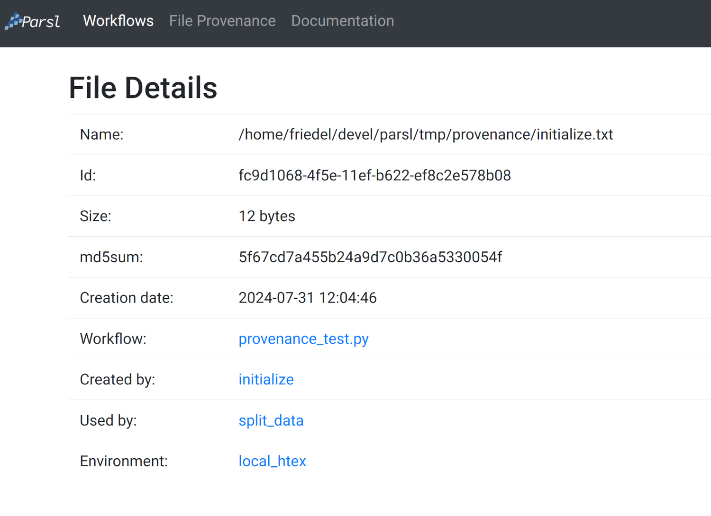

Monitoring
==========

Parsl includes a monitoring system to capture task state as well as resource
usage over time. The Parsl monitoring system aims to provide detailed
information and diagnostic capabilities to help track the state of your
programs, down to the individual apps that are executed on remote machines.

The monitoring system records information to an SQLite database while a
workflow runs. This information can then be visualised in a web dashboard
using the ``parsl-visualize`` tool, or queried using SQL using regular
SQLite tools.

Monitoring configuration
------------------------

Parsl monitoring is only supported with the `parsl.executors.HighThroughputExecutor`.

The following example shows how to enable monitoring in the Parsl
configuration. Here the `parsl.monitoring.MonitoringHub` is specified to use port
55055 to receive monitoring messages from workers every 10 seconds.

.. code-block:: python

   import parsl
   from parsl.monitoring.monitoring import MonitoringHub
   from parsl.config import Config
   from parsl.executors import HighThroughputExecutor
   from parsl.addresses import address_by_hostname

   import logging

   config = Config(
      executors=[
          HighThroughputExecutor(
              label="local_htex",
              cores_per_worker=1,
              max_workers_per_node=4,
              address=address_by_hostname(),
          )
      ],
      monitoring=MonitoringHub(
          hub_address=address_by_hostname(),
          monitoring_debug=False,
          resource_monitoring_interval=10,
      ),
      strategy='none'
   )

File Provenance
---------------

The monitoring system can also be used to track file provenance. File provenance is defined as the
history of a file including:

* When the files was created
* File size in bytes
* File md5sum
* What task created the file
* What task(s) used the file
* What inputs were given to the task that created the file
* What environment was used (e.g. the 'worker_init' entry from a :py:class:`~parsl.providers.ExecutionProvider`),
  not available with every provider.

The purpose of the file provenance tracking is to provide a mechanism where the user can see exactly
how a file was created and used in a workflow. This can be useful for debugging, understanding the
workflow, for ensuring that the workflow is reproducible, and reviewing past work. The file
provenance information is stored in the monitoring database and can be accessed using the
``parsl-visualize`` tool. To enable file provenance tracking, set the ``file_provenance`` flag to
``True`` in the `parsl.monitoring.MonitoringHub` configuration.

This functionality also enables you to log informational messages from you scripts, to capture
anything not automatically gathered. The main change to your code to use this functionality is to
assign the return value of the ``parsl.load`` to a variable. Then use the ``log_info`` function to
log the messages in the database. Note that this feature is only available in the main script, not
inside Apps. Passing this variable, ``my_cfg`` in the example below to an App will have undefined
behavior. The following example shows how to use this feature.

.. code-block:: python

   import parsl
   from parsl.monitoring.monitoring import MonitoringHub
   from parsl.config import Config
   from parsl.executors import HighThroughputExecutor
   from parsl.addresses import address_by_hostname

   import logging

   config = Config(
      executors=[
          HighThroughputExecutor(
              label="local_htex",
              cores_per_worker=1,
              max_workers_per_node=4,
              address=address_by_hostname(),
          )
      ],
      monitoring=MonitoringHub(
          hub_address=address_by_hostname(),
          hub_port=55055,
          monitoring_debug=False,
          resource_monitoring_interval=10,
          file_provenance=True,
      ),
      strategy='none'
   )

   my_cfg = parsl.load(config)

   my_cfg.log_info("This is an informational message")

The file provenance framework also works with the :ref:`label-dynamic-file-list` feature. When a
:py:class:`parsl.data_provider.dynamic_files.DynamicFileList` is used the framework will wait until the app completes
and any files contained in the :py:class:`parsl.data_provider.dynamic_files.DynamicFileList` are marked as done before
completing its processing.

.. note::
    Known limitations: The file provenance feature will capture the creation of files and the use of files in an app,
    but does not capture the modification of files it already knows about.

This functionality also enables you to log informational messages from you scripts, to capture anything not
automatically gathered. The main change to your code to use this functionality is to assign the return value of the
``parsl.load`` to a variable. Then use the ``log_info`` function to log the messages in the database. Note that this
feature is only available in the main script, not inside apps, unless you pass the variable (``my_cfg`` in the example
below), as an argument to the app. The following example shows how to use this feature.

.. code-block:: python

   import parsl
   from parsl.monitoring.monitoring import MonitoringHub
   from parsl.config import Config
   from parsl.executors import HighThroughputExecutor
   from parsl.addresses import address_by_hostname

   import logging

   config = Config(
      executors=[
          HighThroughputExecutor(
              label="local_htex",
              cores_per_worker=1,
              max_workers_per_node=4,
              address=address_by_hostname(),
          )
      ],
      monitoring=MonitoringHub(
          hub_address=address_by_hostname(),
          hub_port=55055,
          monitoring_debug=False,
          resource_monitoring_interval=10,
          capture_file_provenance=True,
      ),
      strategy='none'
   )

   my_cfg = parsl.load(config)

   my_cfg.log_info("This is an informational message")

Visualization
-------------

To run the web dashboard utility ``parsl-visualize`` you first need to install
its dependencies:

   $ pip install 'parsl[monitoring,visualization]'

To view the web dashboard while or after a Parsl program has executed, run
the ``parsl-visualize`` utility::

   $ parsl-visualize

By default, this command expects that the default ``monitoring.db`` database is used
in the runinfo directory. Other databases can be loaded by passing
the database URI on the command line.  For example, if the full path
to the database is ``/tmp/my_monitoring.db``, run::

   $ parsl-visualize sqlite:////tmp/my_monitoring.db

By default, the visualization web server listens on ``127.0.0.1:8080``. If the web server is deployed on a machine with a web browser, the dashboard can be accessed in the browser at ``127.0.0.1:8080``. If the web server is deployed on a remote machine, such as the login node of a cluster, you will need to use an ssh tunnel from your local machine to the cluster::

   $ ssh -L 50000:127.0.0.1:8080 username@cluster_address

This command will bind your local machine's port 50000 to the remote cluster's port 8080.
The dashboard can then be accessed via the local machine's browser at ``127.0.0.1:50000``.

.. warning:: Alternatively you can deploy the visualization server on a public interface. However, first check that this is allowed by the cluster's security policy. The following example shows how to deploy the web server on a public port (i.e., open to Internet via ``public_IP:55555``)::

   $ parsl-visualize --listen 0.0.0.0 --port 55555

Workflows Page
^^^^^^^^^^^^^^

The workflows page lists all Parsl workflows that have been executed with monitoring enabled
with the selected database.
It provides a high level summary of workflow state as shown below:

.. image:: ../../images/mon_workflows_page.png

Throughout the dashboard, all blue elements are clickable. For example, clicking a specific worklow
name from the table takes you to the Workflow Summary page described in the next section.

Workflow Summary
^^^^^^^^^^^^^^^^

The workflow summary page captures the run level details of a workflow, including start and end times
as well as task summary statistics. The workflow summary section is followed by the *App Summary* that lists
the various apps and invocation count for each.

.. image:: ../../images/mon_workflow_summary.png

The workflow summary also presents several different views of the workflow:

* Workflow DAG - with apps differentiated by colors: This visualization is useful to visually inspect the dependency
  structure of the workflow. Hovering over the nodes in the DAG shows a tooltip for the app represented by the node and it's task ID.

.. image:: ../../images/mon_task_app_grouping.png

* Workflow DAG - with task states differentiated by colors: This visualization is useful to identify what tasks have been completed, failed, or are currently pending.

.. image:: ../../images/mon_task_state_grouping.png

* Workflow resource usage: This visualization provides resource usage information at the workflow level.
  For example, cumulative CPU/Memory utilization across workers over time.

.. image:: ../../images/mon_resource_summary.png

* Workflow file provenance (only if enabled and files were used in the workflow): This visualization gives a tabular listing of each task that created (output) or used (input) a file. Each listed file has a link to a page detailing the file's information.

File Provenance
^^^^^^^^^^^^^^^

The file provenance page provides an interface for searching for files and viewing their provenance. The % wildcard can be used in the search bar to match any number of characters. Any results are listed in a table below the search bar. Clicking on a file in the table will take you to the file's detail page.

File Details
^^^^^^^^^^^^

The file details page provides information about a specific file, including the file's name, size, md5sum, and the tasks that created and used the file. Clicking on any of the tasks will take you to their respective details page. If the file was created by a task there will be an entry for the Environment used by that task. Clicking that link will take you to the Environment Details page.

Task Details
^^^^^^^^^^^^

The task details page provides information about a specific instantiation of a task. This information includes task dependencies, executor (environment), input and output files, and task arguments.

Environment Details
^^^^^^^^^^^^^^^^^^^

The environment details page provides information on the compute environment a task was run including the provider and launcher used and the worker_init that was used.

