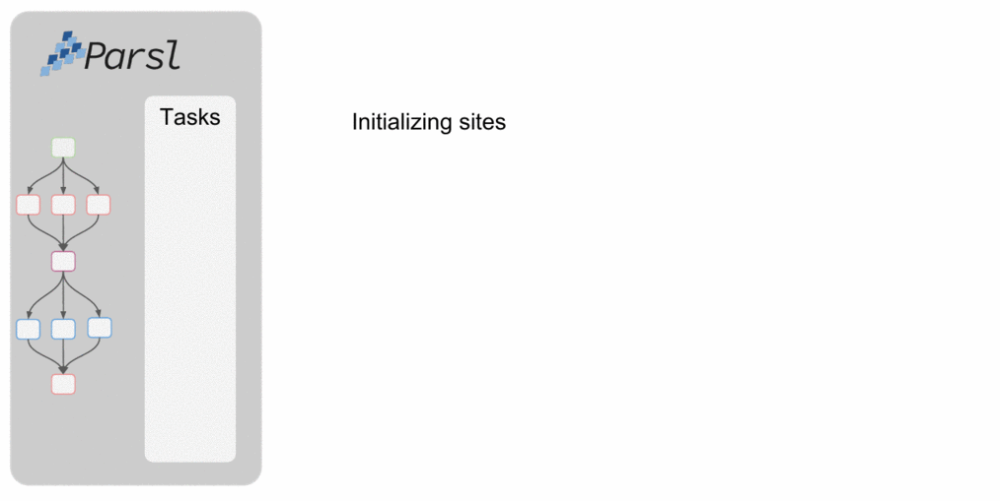

.. _label-elasticity:

Elasticity
----------

Workload resource requirements often vary over time.
For example, in the map-reduce paradigm the map phase may require more
resources than the reduce phase. In general, reserving sufficient
resources for the widest parallelism will result in underutilization
during periods of lower load; conversely, reserving minimal resources
for the thinnest parallelism will lead to optimal utilization
but also extended execution time.
Even simple bag-of-task applications may have tasks of different durations, leading to trailing
tasks with a thin workload.

To address dynamic workload requirements,
Parsl implements a cloud-like elasticity model in which resource
blocks are provisioned/deprovisioned in response to workload pressure.
Given the general nature of the implementation,
Parsl can provide elastic execution on clouds, clusters,
and supercomputers. Of course, in an HPC setting, elasticity may
be complicated by queue delays.

Parsl's elasticity model includes a flow control system
that monitors outstanding tasks and available compute capacity.
This flow control monitor determines when to trigger scaling (in or out)
events to match workload needs.

The animated diagram below shows how blocks are elastically
managed within an executor. The Parsl configuration for an executor
defines the minimum, maximum, and initial number of blocks to be used.

.. image:: img/parsl_scaling.gif

The configuration options for specifying elasticity bounds are:

1. ``min_blocks``: Minimum number of blocks to maintain per executor.
2. ``init_blocks``: Initial number of blocks to provision at initialization of workflow.
3. ``max_blocks``: Maximum number of blocks that can be active per executor.

Parallelism
^^^^^^^^^^^

Parsl provides a user-managed model for controlling elasticity.
In addition to setting the minimum
and maximum number of blocks to be provisioned, users can also define
the desired level of parallelism by setting a parameter (*p*).  Parallelism
is expressed as the ratio of task execution capacity to the sum of running tasks
and available tasks (tasks with their dependencies met, but waiting for execution).
A parallelism value of 1 represents aggressive scaling where the maximum resources
needed are used (i.e., max_blocks); parallelism close to 0 represents the opposite situation in which
as few resources as possible (i.e., min_blocks) are used. By selecting a fraction between 0 and 1,
the provisioning aggressiveness can be controlled.

For example:

- When p = 0: Use the fewest resources possible.  If there is no workload then no blocks will be provisioned, otherwise the fewest blocks specified (e.g., min_blocks, or 1 if min_blocks is set to 0) will be provisioned.

.. code:: python

   if active_tasks == 0:
       blocks = min_blocks
   else:
       blocks = max(min_blocks, 1)

- When p = 1: Use as many resources as possible. Provision sufficient nodes to execute all running and available tasks concurrently up to the max_blocks specified.

.. code-block:: python

   blocks = min(max_blocks,
                ceil((running_tasks + available_tasks) / (workers_per_node * nodes_per_block))

- When p = 1/2: Queue up to 2 tasks per worker before requesting a new block.

Configuration
^^^^^^^^^^^^^

The example below shows how elasticity and parallelism can be configured. Here, a `parsl.executors.HighThroughputExecutor`
is used with a minimum of 1 block and a maximum of 2 blocks, where each block may host
up to 2 workers per node. Thus this setup is capable of servicing 2 tasks concurrently.
Parallelism of 0.5 means that when more than 2 * the total task capacity (i.e., 4 tasks) are queued a new
block will be requested. An example :class:`~parsl.config.Config` is:

.. code:: python

    from parsl.config import Config
    from libsubmit.providers.local.local import Local
    from parsl.executors import HighThroughputExecutor

    config = Config(
        executors=[
            HighThroughputExecutor(
                label='local_htex',
                workers_per_node=2,
                provider=Local(
                    min_blocks=1,
                    init_blocks=1,
                    max_blocks=2,
                    nodes_per_block=1,
                    parallelism=0.5
                )
            )
        ]
    )

The animated diagram below illustrates the behavior of this executor.
In the diagram, the tasks are allocated to the first block, until
5 tasks are submitted. At this stage, as more than double the available
task capacity is used, Parsl provisions a new block for executing the remaining
tasks.

