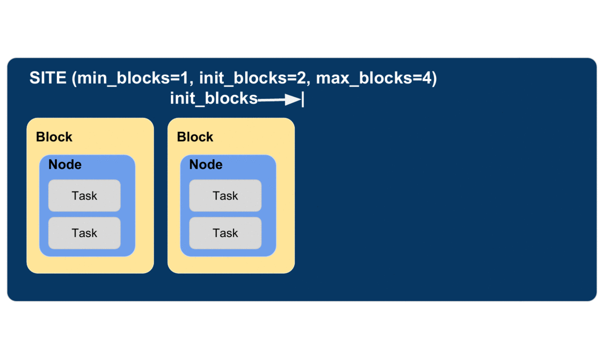
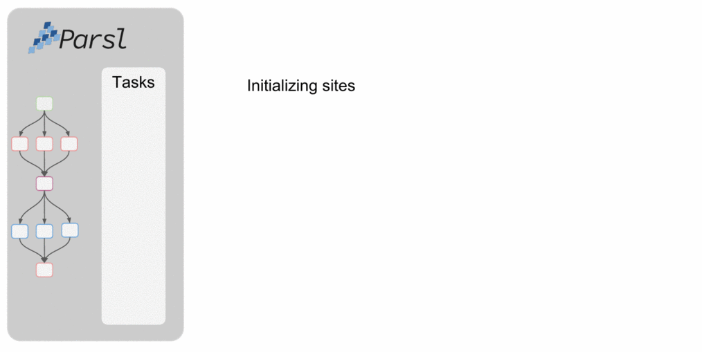

.. _label-elasticity:

Elasticity
==========

Parsl can change the amount of resources available as workloads vary over time.
Allow the amount of workers used by Parsl to change elastically through two mechanisms:

1. Specifying the range of number of "blocks" allowed
2. Controlling the target ratio of number of tasks to workers.

Controlling Number of Blocks
----------------------------

All `Providers <providers.html>`_ request resources in "blocks" of nodes.
The default for most Providers is to request a single block of workers
at the beginning and only request another block if the current one expires.

Allow Parsl to vary the amount of blocks through the following options:

1. ``min_blocks``: Minimum number of blocks to maintain.
2. ``init_blocks``: Initial number of blocks to provision at initialization of workflow.
3. ``max_blocks``: Maximum number of blocks that can be active.

Parallelism
-----------

The ``parallelism`` option of a Provider controls how many blocks are requested as a function of demand.
Parallelism is the ratio of the number of workers available to the number of tasks running or ready to run,
and should be a value between 0 and 1.

For example:

- (default) ``parallelism=1``: Request as many workers as tasks until ``max_blocks`` is met.

.. code-block:: python

   blocks = min(max_blocks, ceil(num_tasks / (workers_per_node * nodes_per_block))

- ``parallelism=0``: Use the fewest resources possible. Request

.. code:: python

   blocks = min_blocks if active_tasks == 0 else max(min_blocks, 1)

- ``parallelism=0.5``: Maintain one worker for every two tasks in queue.

Example Configuration
----------------------

The following configuration shows a ``HighThroughputExecutor``
which will run between 1 and 2 blocks depending on the number of tasks.
Each block is one node in size and each node will host 2 workers (2 workers per block).
Parallelism of 0.5 means that a new block will be requested for every 4 tasks (2 workers per block / 0.5 workers per task).

.. code:: python

    from parsl.config import Config
    from parsl.providers import SlurmProvider
    from parsl.executors import HighThroughputExecutor

    config = Config(
        executors=[
            HighThroughputExecutor(
                max_workers_per_node=2,
                provider=SlurmProvider(
                    min_blocks=1,
                    init_blocks=1,
                    max_blocks=2,
                    nodes_per_block=1,
                    parallelism=0.5
                )
            )
        ]
    )

The animation below shows how the number of blocks will change with the workflow.
Tasks are allocated to the first block until 5 tasks are submitted,
at which point Parsl requests a new block.

