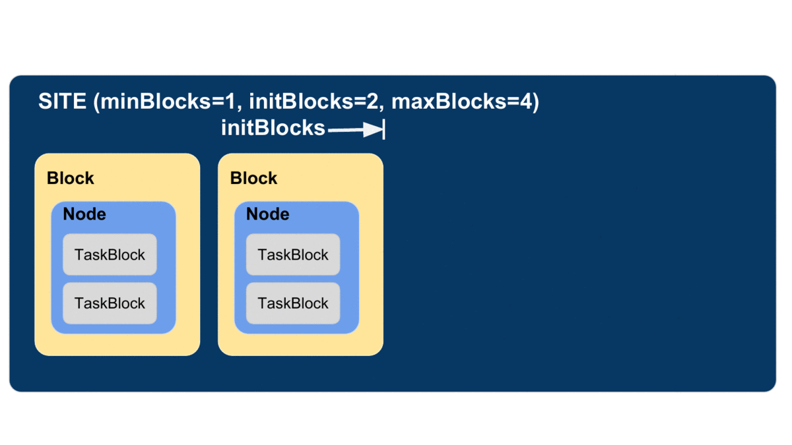

.. _label-execution:

Execution
=========

Contemporary computing environments may include a wide range of computational platforms or **execution providers**, from laptops and PCs to various clusters, supercomputers, and cloud computing platforms. Different execution providers may require or allow for the use of different **execution models**, such as threads (for efficient parallel execution on a multicore processor), processes, and pilot jobs for running many small tasks on a large parallel system. 

Parsl is designed to abstract these low-level details so that an identical Parsl program can run unchanged on different platforms or across multiple platforms. 
To this end, Parsl uses a configuration file to specify which execution provider(s) and execution model(s) to use.
Parsl provides a high level abstraction, called a *block*, for providing a uniform description of a compute resource irrespective of the specific execution provider.

.. note::
   Refer to :ref:`configuration-section` for information on how to configure the various components described
   below for specific scenarios.

Execution providers
-------------------

Clouds, supercomputers, and local PCs offer vastly different modes of access. 
To overcome these differences, and present a single uniform interface, 
Parsl implements a simple provider abstraction. This
abstraction is key to Parsl's ability to enable scripts to be moved
between resources. The provider interface exposes three core actions: submit a
job for execution (e.g., sbatch for the Slurm resource manager), 
retrieve the status of an allocation (e.g., squeue), and cancel a running
job (e.g., scancel). Parsl implements providers for local execution
(fork), for various cloud platforms using cloud-specific APIs, and
for clusters and supercomputers that use a Local Resource Manager
(LRM) to manage access to resources, such as Slurm, HTCondor, 
and Cobalt.

Each provider implementation may allow users to specify additional parameters for further configuration. Parameters are generally mapped to LRM submission script or cloud API options.
Examples of LRM-specific options are partition, wall clock time,
scheduler options (e.g., #SBATCH arguments for Slurm), and worker
initialization commands (e.g., loading a conda environment). Cloud
parameters include access keys, instance type, and spot bid price

Parsl currently supports the following providers:

1. `LocalProvider`: The provider allows you to run locally on your laptop or workstation.
2. `CobaltProvider`: This provider allows you to schedule resources via the Cobalt scheduler.
3. `SlurmProvider`: This provider allows you to schedule resources via the Slurm scheduler.
4. `CondorProvider`: This provider allows you to schedule resources via the Condor scheduler.
5. `GridEngineProvider`: This provider allows you to schedule resources via the GridEngine scheduler.
6. `TorqueProvider`: This provider allows you to schedule resources via the Torque scheduler.
7. `AWSProvider`: This provider allows you to provision and manage cloud nodes from Amazon Web Services.
8. `GoogleCloudProvider`: This provider allows you to provision and manage cloud nodes from Google Cloud.
9. `KubernetesProvider`: This provider allows you to provision and manage containers on a Kubernetes cluster.
10. `AdHocProvider`: This provider allows you manage execution over a collection of nodes to form an ad-hoc cluster.
11. `LSFProvider`: This provider allows you to schedule resources via IBM's LSF scheduler

Executors
---------

Parsl programs vary widely in terms of their
execution requirements. Individual Apps may run for milliseconds
or days, and available parallelism can vary between none for 
sequential programs to millions for "pleasingly parallel" programs.
Parsl executors, as the name suggests, execute Apps on one or more
target execution resources such as multi-core workstations, clouds,
or supercomputers. As it appears infeasible to implement a single
execution strategy that will meet so many diverse requirements on
such varied platforms, Parsl provides a modular executor interface
and a collection of executors that are tuned for common execution
patterns. 

Parsl executors extend the Executor class offered by Python's
concurrent.futures library, which allows Parsl to use 
existing solutions in the Python Standard Library (e.g., ThreadPoolExecutor)
and from other packages such as IPyParallel. Parsl
extends the concurrent.futures executor interface to support 
additional capabilities such as automatic scaling of execution resources,
monitoring, deferred initialization, and methods to set working
directories.
All executors share a common execution kernel that is responsible 
for deserializing the task (i.e., the App and its input arguments)
and executing the task in a sandboxed Python environment.

Parsl currently supports the following executors:

1. `ThreadPoolExecutor`: This executor supports multi-thread execution on local resources.

2. `HighThroughputExecutor`: This executor implements hierarchical scheduling and batching using a pilot job model to deliver high throughput task execution on up to 4000 Nodes.

3. `WorkQueueExecutor`: [**Beta**] This executor integrates `Work Queue <http://ccl.cse.nd.edu/software/workqueue/>`_ as an execution backend. Work Queue scales to tens of thousands of cores and implements reliable execution of tasks with dynamic resource sizing.

4. `ExtremeScaleExecutor`: [**Beta**] The ExtremeScaleExecutor uses `mpi4py <https://mpi4py.readthedocs.io/en/stable/>` to scale to 4000+ nodes. This executor is typically used for executing on supercomputers.

These executors cover a broad range of execution requirements. As with other Parsl components, there is a standard interface (ParslExecutor) that can be implemented to add support for other executors.

.. note::
   Refer to :ref:`configuration-section` for information on how to configure these executors.

Launchers
---------

Many LRMs offer mechanisms for spawning applications across nodes 
inside a single job and for specifying the
resources and task placement information needed to execute that
application at launch time. Common mechanisms include
`srun <https://slurm.schedmd.com/srun.html>`_ (for Slurm), 
`aprun <https://cug.org/5-publications/proceedings_attendee_lists/2006CD/S06_Proceedings/pages/Authors/Karo-4C/Karo_alps_paper.pdf>`_ (for Crays), and `mpirun <https://www.open-mpi.org/doc/v2.0/man1/mpirun.1.php>`_ (for MPI). 
Thus, to run Parsl programs on such systems, we typically want first to 
request a large number of nodes and then to *launch* "pilot job" or 
**worker** processes using the system launchers. 
Parsl's Launcher abstraction enables Parsl programs
to use these system-specific launcher systems to start workers across 
cores and nodes.

Parsl currently supports the following set of launchers:

1. `SrunLauncher`: Srun based launcher for Slurm based systems.
2. `AprunLauncher`: Aprun based launcher for Crays.
3. `SrunMPILauncher`: Launcher for launching MPI applications with Srun.
4. `GnuParallelLauncher`: Launcher using GNU parallel to launch workers across nodes and cores.
5. `MpiExecLauncher`: Uses Mpiexec to launch.
6. `SimpleLauncher`: The launcher default to a single worker launch.
7. `SingleNodeLauncher`: This launcher launches ``workers_per_node`` count workers on a single node.

Additionally, the launcher interface can be used to implement specialized behaviors
in custom environments (for example, to
launch node processes inside containers with customized environments). 
For example, the following launcher uses Srun to launch ``worker-wrapper``, passing the
command to be run as parameters to ``worker-wrapper``. It is the responsibility of ``worker-wrapper``
to launch the command it is given inside the appropriate environment.

.. code:: python

   class MyShifterSRunLauncher:
       def __init__(self):
           self.srun_launcher = SrunLauncher()

       def __call__(self, command, tasks_per_node, nodes_per_block):
           new_command="worker-wrapper {}".format(command)
           return self.srun_launcher(new_command, tasks_per_node, nodes_per_block)

Blocks
------

One challenge when making use of heterogeneous 
execution resource types is the need to provide a uniform representation of
resources. Consider that single requests on clouds return individual
nodes, clusters and supercomputers provide batches of nodes, grids
provide cores, and workstations provide a single multicore node

Parsl defines a resource abstraction called a *block* as the most basic unit
of resources to be acquired from a provider. A block contains one
or more nodes and maps to the different provider abstractions. In
a cluster, a block corresponds to a single allocation request to a
scheduler. In a cloud, a block corresponds to a single API request
for one or more instances. 
Parsl can then execute *tasks* (instances of apps)
within and across (e.g., for MPI jobs) nodes within a block.
Blocks are also used as the basis for
elasticity on batch scheduling systems (see Elasticity below).
Three different examples of block configurations are shown below.

1. A single block comprised of a node executing one task:

   .. image:: ../images/N1_T1.png
      :scale: 75%

2. A single block with one node executing several tasks. This configuration is
   most suitable for single threaded apps running on multicore target systems.
   The number of tasks executed concurrently is proportional to the number of cores available on the system.

   .. image:: ../images/N1_T4.png
       :scale: 75%

3. A block comprised of several nodes and executing several tasks, where a task can span multiple nodes. This configuration
   is generally used by MPI applications. Starting a task requires using a specific
   MPI launcher that is supported on the target system (e.g., aprun, srun, mpirun, mpiexec).

   .. image:: ../images/N4_T2.png

The configuration options for specifying the shape of each block are:

1. ``workers_per_node``: Number of workers started per node, which corresponds to the number of tasks that can execute concurrently on a node.
2. ``nodes_per_block``: Number of nodes requested per block.

.. _label-elasticity:

Elasticity
----------

Workload resource requirements often vary over time. 
For example, in the map-reduce paradigm the map phase may require more
resources than the reduce phase. In general, reserving sufficient
resources for the widest parallelism will result in underutilization
during periods of lower load; conversely, reserving minimal resources 
for the thinnest parallelism will lead to optimal utilization
but also extended execution time. 
Even simple bag-of-task applications may have tasks of different durations, leading to trailing
tasks with a thin workload. 

To address dynamic workload requirements, 
Parsl implements a cloud-like elasticity model in which resource
blocks are provisioned/deprovisioned in response to workload pressure. 
Parsl provides an extensible strategy interface by which users
can implement their own elasticity logic. 
Given the general nature of the implementation, 
Parsl can provide elastic execution on clouds, clusters,
and supercomputers. Of course, in an HPC setting, elasticity may
be complicated by queue delays.

Parsl's elasticity model includes an extensible flow control system
that monitors outstanding tasks and available compute capacity.
This flow control monitor, which can be extended or implemented by users,
determines when to trigger scaling (in or out) events to match
workload needs.

The animated diagram below shows how blocks are elastically
managed within an executor. The Parsl configuration for an executor
defines the minimum, maximum, and initial number of blocks to be used.

The configuration options for specifying elasticity bounds are:

1. ``min_blocks``: Minimum number of blocks to maintain per executor.
2. ``init_blocks``: Initial number of blocks to provision at initialization of workflow.
3. ``max_blocks``: Maximum number of blocks that can be active per executor.

Parallelism
^^^^^^^^^^^

Parsl provides a user-managed model for controlling elasticity.
In addition to setting the minimum
and maximum number of blocks to be provisioned, users can also define
the desired level of parallelism by setting a parameter (*p*).  Parallelism
is expressed as the ratio of task execution capacity to the sum of running tasks
and available tasks (tasks with their dependencies met, but waiting for execution).
A parallelism value of 1 represents aggressive scaling where the maximum resources
needed are used (i.e., max_blocks); parallelism close to 0 represents the opposite situation in which
as few resources as possible (i.e., min_blocks) are used. By selecting a fraction between 0 and 1,
the provisioning aggressiveness can be controlled.

For example:

- When p = 0: Use the fewest resources possible.  If there is no workload then no blocks will be provisioned, otherwise the fewest blocks specified (e.g., min_blocks, or 1 if min_blocks is set to 0) will be provisioned.  

.. code:: python

   if active_tasks == 0:
       blocks = min_blocks
   else:
       blocks = max(min_blocks, 1)

- When p = 1: Use as many resources as possible. Provision sufficient nodes to execute all running and available tasks concurrently up to the max_blocks specified. 

.. code-block:: python

   blocks = min(max_blocks,
                ceil((running_tasks + available_tasks) / (workers_per_node * nodes_per_block))

- When p = 1/2: Queue up to 2 tasks per worker before requesting a new block.

Configuration
^^^^^^^^^^^^^

The example below shows how elasticity and parallelism can be configured. Here, a `HighThroughputExecutor`
is used with a minimum of 1 block and a maximum of 2 blocks, where each block may host
up to 2 workers per node. Thus this setup is capable of servicing 2 tasks concurrently. 
Parallelism of 0.5 means that when more than 2 * the total task capacity (i.e., 4 tasks) are queued a new
block will be requested. An example :class:`~parsl.config.Config` is:

.. code:: python

    from parsl.config import Config
    from libsubmit.providers.local.local import Local
    from parsl.executors import HighThroughputExecutor

    config = Config(
        executors=[
            HighThroughputExecutor(
                label='local_htex',
                workers_per_node=2,
                provider=Local(
                    min_blocks=1,
                    init_blocks=1,
                    max_blocks=2,
                    nodes_per_block=1,
                    parallelism=0.5
                )
            )
        ]
    )

The animated diagram below illustrates the behavior of this executor.
In the diagram, the tasks are allocated to the first block, until
5 tasks are submitted. At this stage, as more than double the available
task capacity is used, Parsl provisions a new block for executing the remaining
tasks.

.. image:: parsl_parallelism.gif

Multi-executor
--------------

Parsl supports the use of one or more executors as specified in the configuration. 
In this situation, individual apps may indicate which executors they are able to use. 

The common scenarios for this feature are:

* A workflow has an initial simulation stage that runs on the compute heavy
  nodes of an HPC system followed by an analysis and visualization stage that
  is better suited for GPU nodes.
* A workflow follows a repeated fan-out, fan-in model where the long running
  fan-out tasks are computed on a cluster and the quick fan-in computation is
  better suited for execution using threads on a login node.
* A workflow includes apps that wait and evaluate the results of a
  computation to determine whether the app should be relaunched.
  Only apps running on threads may launch other apps. Often, simulations
  have stochastic behavior and may terminate before completion.
  In such cases, having a wrapper app that checks the exit code
  and determines whether or not the app has completed successfully can
  be used to automatically re-execute the app (possibly from a
  checkpoint) until successful completion.

The following code snippet shows how apps can specify suitable executors in the app decorator.

.. code-block:: python

     #(CPU heavy app) (CPU heavy app) (CPU heavy app) <--- Run on compute queue
     #      |                |               |
     #    (data)           (data)          (data)
     #       \               |              /
     #       (Analysis and visualization phase)         <--- Run on GPU node

     # A mock molecular dynamics simulation app
     @bash_app(executors=["Theta.Phi"])
     def MD_Sim(arg, outputs=[]):
         return "MD_simulate {} -o {}".format(arg, outputs[0])

     # Visualize results from the mock MD simulation app
     @bash_app(executors=["Cooley.GPU"])
     def visualize(inputs=[], outputs=[]):
         bash_array = " ".join(inputs)
         return "viz {} -o {}".format(bash_array, outputs[0])
