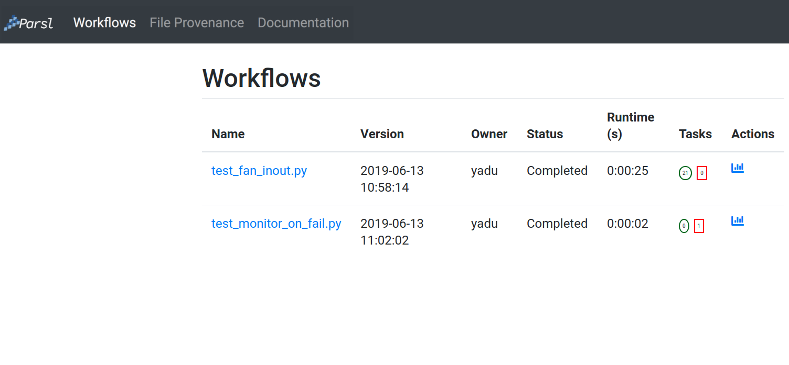
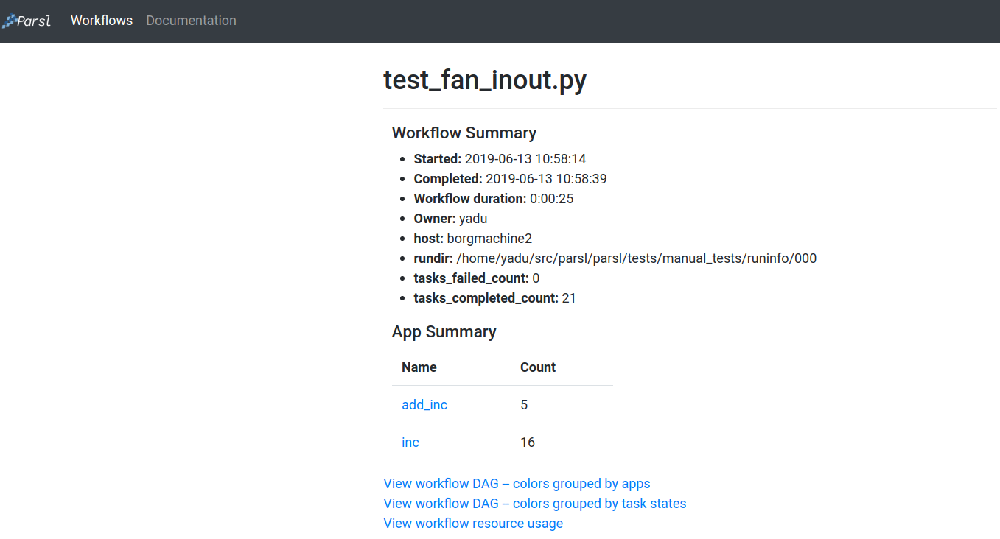
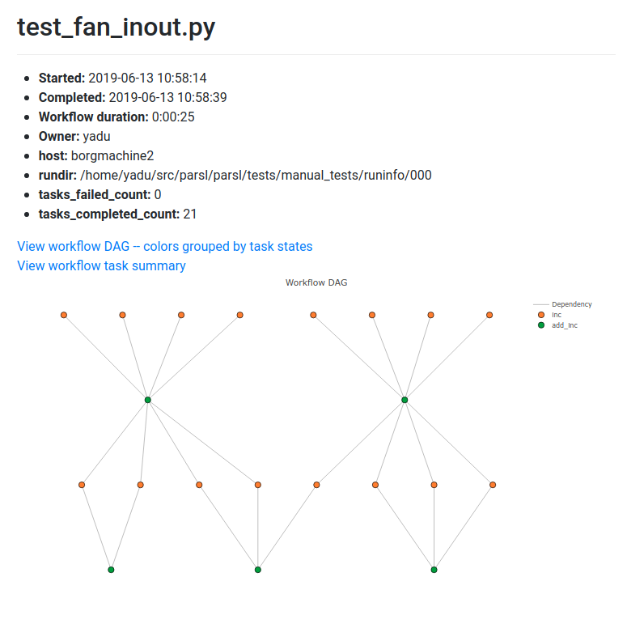
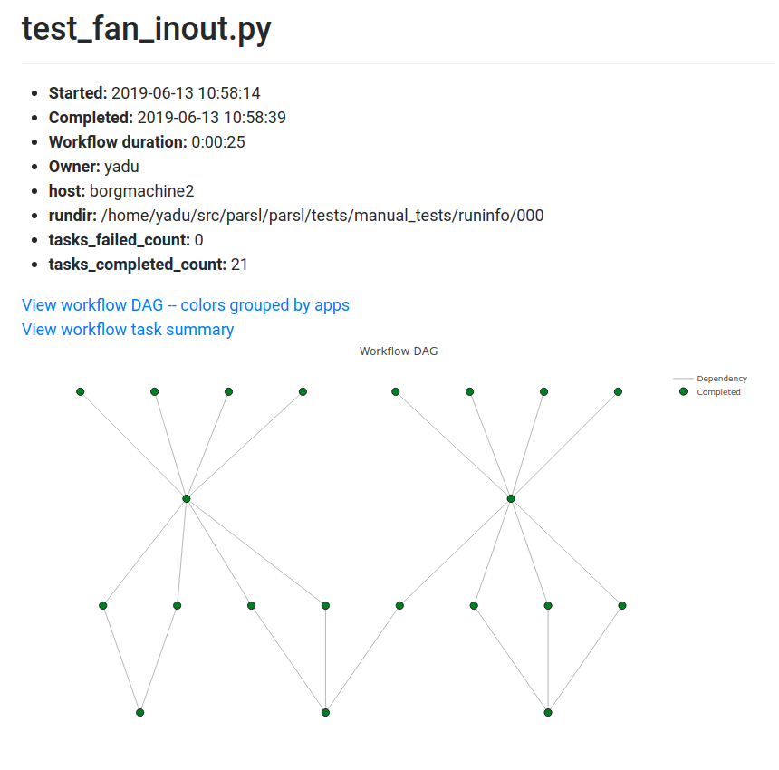
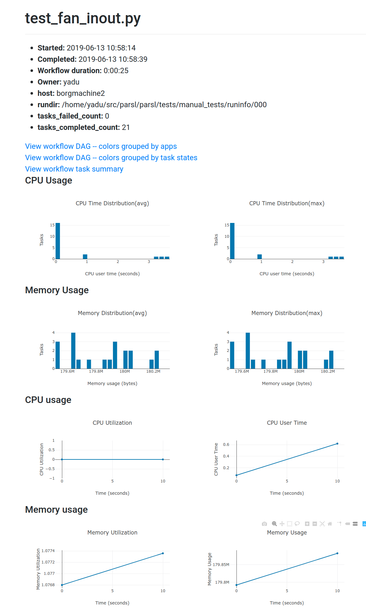

Monitoring
==========

Parsl includes a flexible monitoring system to capture program and task state as well 
as resource usage over time. The Parsl monitoring system aims to provide detailed
information and diagnostic
capabilities to help track the state of your programs, down to the individual apps that are
executed on remote machines. 

Installation
------------

Parsl's monitoring system is implemented as a lightweight service with an associated
database for capturing monitoring information and a graphical web-based dashboard
for viewing and exploring monitoring information.  By default, a local SQLite 
database is used to store monitoring information in a file.

Monitoring configuration
------------------------

Parsl monitoring is only supported with the `HighThroughputExecutor`. 

The following example shows how to enable monitoring in the Parsl
configuration. Here the `MonitoringHub` is specified to use port
55055 to receive monitoring messages from workers every 10 seconds.

.. code-block:: python

   import parsl
   from parsl.monitoring.monitoring import MonitoringHub
   from parsl.config import Config
   from parsl.executors import HighThroughputExecutor
   from parsl.addresses import address_by_hostname

   import logging

   config = Config(
      executors=[
          HighThroughputExecutor(
              label="local_htex",
              cores_per_worker=1,
              max_workers=4,
              address=address_by_hostname(),
          )
      ],
      monitoring=MonitoringHub(
          hub_address=address_by_hostname(),
          hub_port=55055,
          monitoring_debug=False,
          resource_monitoring_interval=10,
      ),
      strategy=None
   )

Visualization
-------------

To view the web dashboard during or after a Parsl program has executed, you
need to first run the ``parsl-visualize`` utility::

   $ parsl-visualize

By default, this command expects that the default ``monitoring.db`` database is used
in the current working directory. Other database can be loaded by passing
the database URI on the command line.  For example, if the full path
to the database is ``/tmp/my_monitoring.db``, run::

   $ parsl-visualize sqlite:////tmp/my_monitoring.db

By default, the visualization web server listens on ``127.0.0.1:8080``. If the web server is deployed on a machine with a web browser, the dashboard can be accessed in the browser at ``127.0.0.1:8080``. If the web server is deployed on a remote machine, such as the login node of a cluster, you will need to use an ssh tunnel from your local machine to the cluster::

   $ ssh -L 50000:127.0.0.1:8080 username@cluster_address

This command will bind your local machine's port 50000 to the remote cluster's port 8080.
The dashboard can then be accessed via the local machine's browser at ``127.0.0.1:50000``. 

.. warning:: Alternatively you can deploy the visualization server on a public interface. However, first check that this is allowed by the cluster's security policy. The following example shows how to deploy the web server on a public port (i.e., open to Internet via ``public_IP:55555``)::

   $ parsl-visualize --listen 0.0.0.0 --port 55555

Workflows Page
^^^^^^^^^^^^^^

The workflows page lists all Parsl workflows that have been executed with monitoring enabled
with the selected database.
It provides a high level summary of workflow state as shown below:

Throughout the dashboard, all blue elements are clickable. For example, clicking a specific worklow
name from the table takes you to the Workflow Summary page described in the next section.

Workflow Summary
^^^^^^^^^^^^^^^^

The workflow summary page captures the run level details of a workflow, including start and end times
as well as task summary statistics. The workflow summary section is followed by the *App Summary* that lists
the various apps and invocation count for each. 

The workflow summary also presents three different views of the workflow:

* Workflow DAG - with apps differentiated by colors: This visualization is useful to visually inspect the dependency
  structure of the workflow. Hovering over the nodes in the DAG shows a tooltip for the app represented by the node and it's task ID.

* Workflow DAG - with task states differentiated by colors: This visualization is useful to identify what tasks have been completed, failed, or are currently pending.

* Workflow resource usage: This visualization provides resource usage information at the workflow level.
  For example, cumulative CPU/Memory utilization across workers over time.

