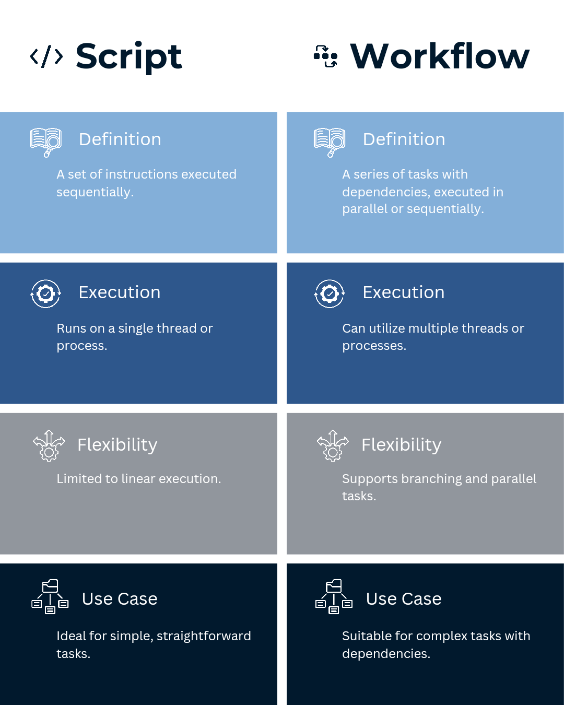
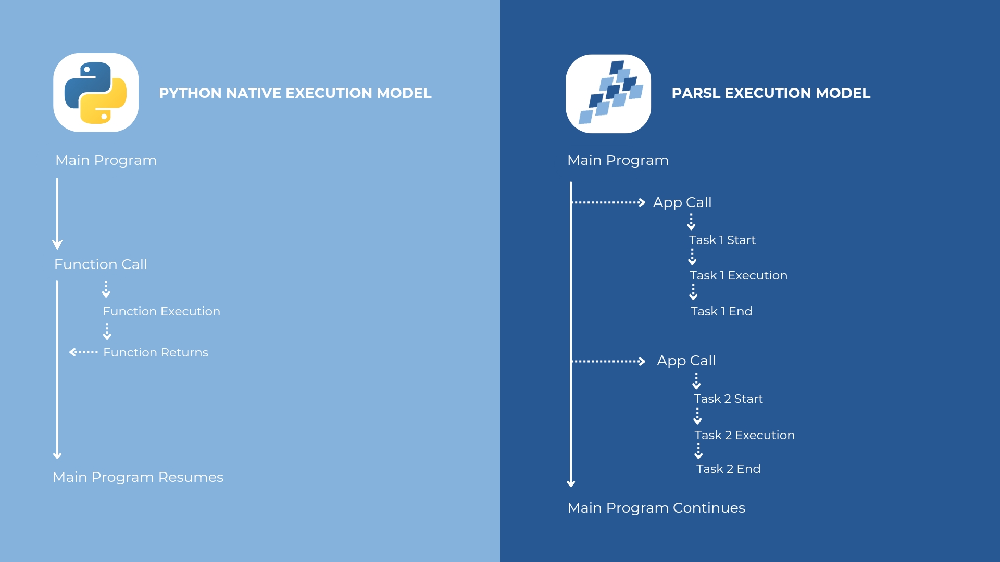

Overview
========

What is Parsl and What Can It Be Used For?
------------------------------------------

**Parsl** is a Python library designed to simplify the process of splitting a problem into smaller tasks that can be executed at the same time – in parallel – using multiple computing resources (parallel programming). It allows you to write Python code that can run across multiple computers or processors at the same time, potentially speeding up your calculations and data processing tasks significantly. Parsl is particularly well-suited for problems that can be broken down into smaller, independent steps. It can handle a wide range of applications, from simple Python functions to complex workflows involving multiple steps and different types of tasks.

Common Applications
~~~~~~~~~~~~~~~~~~~

- **Data processing and analysis:** Parsl can process large datasets in parallel, speeding up tasks like data cleaning, transformation, and analysis. Researchers can use Parsl to parallelize genomic data analysis, where large datasets of DNA sequences are cleaned, aligned, and analyzed to identify genetic variations. This process can be significantly accelerated by executing tasks like sequence alignment and variant calling in parallel across multiple computing nodes.
  
- **Scientific simulations:** Parsl can run complex simulations in parallel, such as those used in physics, chemistry, and biology. For instance, Parsl has been used in chemistry to parallelize dynamic simulations of small CO\ :sub:`2` molecule clusters. This involves using a flexible monomer two-body carbon dioxide potential function to understand the vibrational structure of these clusters at high levels of quantum mechanical theory. By running these simulations in parallel, computational efficiency is increased, and statistical sampling is improved.

- **Machine learning:** Parsl can train and deploy machine learning models in parallel, improving performance and scalability. For example, Parsl can be employed to parallelize the training of models by training multiple deep learning models with different hyperparameters simultaneously to find the best-performing model. This parallel training can be done across various GPUs, reducing the time required to train and evaluate the models.

- **Parameter studies:** Parsl can run multiple program instances with different parameters in parallel, exploring a wider range of possibilities. For example, in materials science, researchers might run simulations to study the properties of new materials under different conditions. By using Parsl, they can execute multiple simulation instances with varying parameters, like temperature or pressure, in parallel. This allows for a comprehensive exploration of the material’s behavior across various conditions.

Script vs. Workflow
-------------------

In Parsl, there's a distinction between a **script** and a **workflow**.

- **Script:** A single Python file containing Parsl code. It defines the tasks to be executed and their dependencies.

- **Workflow:** The actual execution of a Parsl script. It involves coordinating multiple tasks across different resources, such as processors or computers.

Understanding the role of a Parsl script and a workflow is like understanding the difference between a recipe and the cooking process. A Parsl script can be thought of as a recipe, where the ingredients are the tasks and the steps are the dependencies. The workflow, on the other hand, is the process of cooking that recipe. It orchestrates the actual cooking process, ensuring that the steps are followed correctly and the ingredients are combined at the right time.

Key Features and Benefits
~~~~~~~~~~~~~~~~~~~~~~~~~

Parsl offers several features and benefits that make it a powerful tool for parallel programming.

- **Python-based:** Parsl is written in this popular and easy-to-learn programming language. This makes it accessible to a wide range of users, including those without extensive experience in parallel programming.

- **Works everywhere:** Parsl can run on various platforms, from your laptop to large-scale clusters and supercomputers. This flexibility allows you to develop and test your code locally and then easily scale it up to larger systems.

- **Flexible:** Parsl supports different tasks, including Python functions, Bash scripts, and MPI applications. This allows you to leverage existing code and tools in your parallel workflows.

- **Handles data:** Parsl can automatically manage the data movement between tasks, even if they are running on different computers. This simplifies the development of data-intensive workflows.

- **Fast:** Parsl is designed to be efficient and handle thousands of tasks per second, making it suitable for high-performance computing applications.

Understanding Concurrency and Parallelism
-----------------------------------------

Concurrency vs. Parallelism
~~~~~~~~~~~~~~~~~~~~~~~~~~~~

Concurrency and parallelism are related but distinct concepts in computing.

- **Concurrency** is a program's ability to handle multiple tasks at once. These tasks may not necessarily be executed simultaneously but can be interleaved or overlapped.

- **Parallelism** is the simultaneous execution of multiple tasks on different processors or computers. This requires hardware support for parallel processing, such as multiple cores or nodes.

Concurrency is a more general concept that can be achieved even on a single processor through techniques such as time-sharing or multithreading. Parallelism, on the other hand, requires multiple processors and involves the actual simultaneous execution of tasks.

Parsl enables both concurrency and parallelism. It allows you to define tasks that can be executed concurrently and leverages parallel hardware to run those tasks simultaneously on different processors or computers.

Parsl Facilitates Parallel Computing
~~~~~~~~~~~~~~~~~~~~~~~~~~~~~~~~~~~~

Parsl makes parallel computing easier by offering a simple way to define and run tasks. You don't need to worry about the low-level details of managing threads, processes, or inter-node communication. Parsl takes care of these aspects, allowing you to focus on your application logic.

Here's how:

- **Task definition:** You define tasks as Python functions or Bash scripts, using decorators to indicate that they can be run in parallel.

- **Dependency management:** You specify dependencies between tasks, indicating which tasks must be completed before others can start.

- **Resource allocation:** Parsl automatically allocates resources (processors or computers) to tasks based on their dependencies and the available resources.

- **Task execution:** Parsl executes tasks in parallel by utilizing available resources.

- **Data management:** Parsl automatically manages the data movement between tasks, ensuring each task has the necessary input data when it starts.

- **Result collection:** Parsl collects the results of tasks as they are completed, allowing you to access them in your Python code.

By handling these aspects, Parsl makes writing parallel programs that are efficient, scalable, and portable across different platforms easier.

Getting Started with Parsl
===========================

Installation and Setup
----------------------

System Requirements and Dependencies
~~~~~~~~~~~~~~~~~~~~~~~~~~~~~~~~~~~~~

Parsl is compatible with Python 3.8 or newer. It has been tested on Linux. To install Parsl, you must have Python and pip (Python's package installer) on your system.

Windows OS
~~~~~~~~~~

While Parsl is not officially supported on Windows, you can install and run it using the `Windows Subsystem for Linux (WSL) <https://docs.microsoft.com/en-us/windows/wsl/install>`_, which allows you to run a Linux environment directly on Windows. If you want to lead the development of Windows OS support for Parsl, please participate in this issue: `GitHub Issue #1878 <https://github.com/Parsl/parsl/issues/1878>`_.

To install Parsl in WSL, follow these steps:

.. code-block:: bash

   dism.exe /online /enable-feature /featurename:Microsoft-Windows-Subsystem-Linux /all /norestart

Install a Linux distribution (e.g., Ubuntu) and update and upgrade packages:

.. code-block:: bash

   sudo apt update && sudo apt upgrade

Install Python and pip:

.. code-block:: bash

   sudo apt install python3 python3-pip

Install Parsl:

.. code-block:: bash

   python3 -m pip install parsl

Docker
~~~~~~

Docker is a platform for developing, shipping, and running container applications. You can use Docker to create a portable Parsl environment that can run on any system with Docker installed.

To install Parsl in Docker, follow these steps:

.. code-block:: bash

   docker pull parsl/parsl

Run a Parsl container:

.. code-block:: bash

   docker run -it parsl/parsl bash

MacOS
~~~~~

Parsl can be installed on macOS using pip or conda. If you use a Mac with an M1 chip, you may need to install Parsl in a Rosetta terminal to ensure compatibility with the required libraries. 

Linux
~~~~~

Parsl is well-supported on Linux and can be installed using pip or conda. You can access the terminal by searching for "terminal" in your applications menu or by pressing Ctrl+Alt+T.

Android
~~~~~~~

Parsl is not designed to run on Android devices directly. However, there are workarounds, such as using online platforms like Google Colaboratory to run Parsl scripts in a web browser environment. These platforms provide a Jupyter Notebook interface where you can write and execute Parsl code.

Installing Parsl
~~~~~~~~~~~~~~~~

You can easily install Parsl using pip:

.. code-block:: bash

   python3 -m pip install parsl

To check if it is installed correctly, run the following command in your terminal or command prompt:

.. code-block:: bash

   parsl --version

If Parsl is installed, this command will print the version number. If you get an error, double-check that Python and pip are installed correctly.

To upgrade Parsl to the latest version, use:

.. code-block:: bash

   python3 -m pip install -U parsl

If you are using the conda package manager, you can install Parsl from the conda-forge channel:

.. code-block:: bash

   conda config --add channels conda-forge
   conda install parsl

Common Errors
~~~~~~~~~~~~~

Here are some common errors you might encounter during installation and how to fix them:

- **Dependency errors:** Parsl has several dependencies, such as `pyzmq`, `dill`, and `globus-sdk`. If you encounter errors related to these dependencies, try installing them manually using pip. For example:

  .. code-block:: bash

     python3 -m pip install pyzmq dill globus-sdk

- **ERROR: Could not find a version that satisfies the requirement parsl:** This means that pip cannot find a compatible version of Parsl for your Python version. Make sure you are using Python 3.8 or newer.

- **ModuleNotFoundError: No module named 'parsl':** This means that Parsl is not installed. Make sure you have followed the installation instructions correctly.

- **Permission errors:** If you get permission errors during installation, try running the pip command with `sudo` (Linux/macOS) or as an administrator (Windows).

If you encounter other errors, please consult the Parsl documentation or seek help from the Parsl community in the `#parsl-help <https://parsl.slack.com>`_ channel on Slack.

Basic Configuration
-------------------

Parsl separates your code (the tasks you want to run) from how it's executed (where and how those tasks run). This is done through a configuration file that tells Parsl how to use your computing resources.

A simple configuration for running Parsl on your local machine might look like this:

.. code-block:: python

   from parsl.config import Config
   from parsl.executors import ThreadPoolExecutor

   config = Config(
       executors=[ThreadPoolExecutor(max_threads=4)]
   )

This configuration tells Parsl to use your local machine's resources and run tasks using up to 4 threads in parallel.

First Steps
===========

Writing a Parsl Script
----------------------

A Parsl script is a Python script that defines the tasks you want to run in parallel and how they depend on each other.

Here's a simple example:

.. code-block:: python

   !pip install parsl
   import parsl
   from parsl.config import Config
   from parsl.executors import HighThroughputExecutor

   # Configure Parsl (Local Threads)
   config = Config(executors=[HighThroughputExecutor(max_workers=4)]) # Use 4 threads 
   parsl.load(config)

   import parsl
   from parsl import python_app

   @python_app
   def my_task(x):
       return x * 2

   results = []
   for i in range(10):
       results.append(my_task(i))

   # Indent the following block to be part of the 'for' loop
   for result in results:
       print(result.result())

These scripts define a task called `my_task` that doubles a number. Run the first and then the second (top to bottom). It then creates 10 instances of this task, each with a different input, and runs them in parallel. Finally, it prints the results as they become available. To check if this script worked, you should see the numbers 0 through 18 printed to your console, although not necessarily in order.

.. image:: ../images/overview/BasicParslScriptFlow.jpg
   :alt: Basic Parsl Script Flow
   :align: center

Parsl Script Basic Workflow
~~~~~~~~~~~~~~~~~~~~~~~~~~~

- **Import Parsl:** The script begins by importing the Parsl library, which provides the necessary tools and functions for parallel execution.
- **Load Configuration:** A configuration object is loaded, specifying the resources (e.g., local threads, clusters, clouds) that Parsl will use to execute tasks. This step is crucial as it tailors Parsl's behavior to the specific computing environment.
- **Define Apps:** Python functions are decorated with special tags (`@python_app` or `@bash_app`) to indicate that they can be run in parallel as independent tasks.
- **Call Apps:** The decorated functions (apps) are invoked, creating futures. Futures are placeholders for the results of these parallel tasks, allowing the script to continue without waiting for each task to finish.
- **DataFlowKernel (DFK):** The DFK, the core of Parsl, takes over. It manages the execution of tasks, ensuring they run when their dependencies (e.g., input data) are ready and resources are available.
- **Task Execution:** The DFK sends tasks to executors, which are responsible for running the tasks on the specified resources (e.g., different cores or nodes).
- **Get Results:** Once tasks are completed, the `.result()` method is used to retrieve the results from the futures. The script can then use these results for further processing or analysis.
- **End:** The script concludes after all tasks have been executed and their results have been retrieved.

To run a Parsl script, you first need to load the configuration:

.. code-block:: python

   parsl.load(config)

This tells Parsl how to execute the tasks in your script. Once the configuration is loaded, you can run your script like any other Python script.

Practical Tutorial: Hello World with Parsl
------------------------------------------

Let's look at a simplified example:

.. code-block:: python

   import parsl
   from parsl import python_app

   # Define a Parsl app (a function that can run in parallel)
   @python_app
   def hello():
       return "Hello Frodo!"

   # Run the app and get the result
   result = hello().result()
   print(result)  # Output: Hello, Frodo!

This script defines a Parsl app called `hello` that takes a name and returns a greeting. It then runs the app with the input "Frodo" and prints the result. If this script worked, you should see "Hello, Frodo!" printed to your console.

Getting Started Tutorial
========================

The best way to learn Parsl is by doing. Let's revisit the "Hello World" example from above in-depth:

.. code-block:: python

   import parsl
   from parsl import python_app

   # Start Parsl
   parsl.load(config)

   # Define a Parsl app (a function that can run in parallel)
   @python_app
   def hello(name):
       return f'Hello, {name}!'

   # Run the app and get the result
   result = hello("World").result()
   print(result)  # Output: Hello, World!

This script demonstrates the core components of a Parsl program:

- **Importing Parsl:** The `import parsl` line brings in the Parsl library, giving you access to its functions and classes.
- **Loading Configuration:** The `parsl.load(config)` line initializes Parsl with your chosen configuration. This configuration specifies how Parsl will use your computing resources. In this example, we're using a simple configuration for running Parsl on your local machine.
- **Defining an App:** The `@python_app` decorator tells Parsl that the `hello` function is a Parsl app, meaning it can be run in parallel.
- **Calling the App:** The `hello("World")` line calls the app with the argument "World". This doesn't run the function immediately; instead, it returns a future, a placeholder for the result that will be available later.
- **Getting the Result:** The `.result()` method waits for the app to finish and then returns the result, which is the string "Hello, World!".
- **Printing the Result:** The last line prints the result to the console.

Practical Example: Setting Up Your First Parsl Workflow
-------------------------------------------------------

To set up your first Parsl workflow, you'll need to:

1. **Install Parsl:** Follow the instructions in the "Installation and Setup" section to install Parsl on your system.
2. **Choose a configuration:** Select a configuration that matches your computing environment. Parsl provides several example configurations for different platforms, such as laptops, clusters, and clouds. You can also create custom settings.
3. **Write a Parsl script:** Define the tasks you want to run in parallel and their dependencies.
4. **Load the configuration:** Use the `parsl.load()` function to load your chosen configuration.
5. **Run your script:** Execute a Parsl script like any other Python script. Parsl will then take care of executing your tasks in parallel, managing dependencies, and moving data as needed.

.. _parsl_docs: https://parsl.readthedocs.io/en/stable/

For more details on using Parsl, check out the `Parsl documentation <https://parsl.readthedocs.io/en/stable/>`_.

Core Concepts
=============

Parsl and Concurrency
---------------------

Parsl is designed to make parallel programming easier in Python. It allows you to break down your code into smaller tasks that can run concurrently, meaning they can be executed at the same time or in an overlapping manner. This is different from traditional Python code, which runs one line at a time in sequence.

When you call a Parsl app (a function decorated with `@python_app` or `@bash_app`), Parsl creates a new task that runs independently of your main program. This means your main program can continue running while the task is being executed, potentially on a different processor or computer.

Introduction to Futures
-----------------------

To manage these concurrent tasks, Parsl uses **futures**. A future is a placeholder for the result of a task that hasn't finished yet. You can think of it like a meal ticket in a restaurant. You get the ticket immediately, but you have to wait for the meal to be prepared. Similarly, when you call a Parsl app, you get a future right away, but you have to wait for the task to complete before you can access the result.

Understanding AppFutures and DataFutures
~~~~~~~~~~~~~~~~~~~~~~~~~~~~~~~~~~~~~~~~

- **AppFutures:** Represent the execution of a Parsl app. You can use an AppFuture to check the status of a task, wait for it to finish, and get the result or any exceptions that occurred.

- **DataFutures:** Represent files produced by a Parsl app. They allow you to track the creation of output files and ensure that they are ready before being used as inputs to other tasks.

Parsl and Execution
-------------------

Execution providers, executors, and launchers make Parsl's ability to run tasks on different resources possible.

Execution Providers, Executors, and Launchers
~~~~~~~~~~~~~~~~~~~~~~~~~~~~~~~~~~~~~~~~~~~~~

- **Execution Providers:** These components connect Parsl to the computing resources you want to use, whether it's your local machine, a cluster, or a cloud platform. They handle the details of submitting jobs, checking their status, and canceling them if needed.

- **Executors:** These components manage the execution of tasks on the resources provided by the execution provider. They decide when and where to run each task, taking into account factors like dependencies between tasks and the availability of resources.

- **Launchers:** These components are responsible for starting the worker processes that actually execute the tasks. They work with the execution provider to ensure that the workers are launched on the correct resources and with the correct environment.

Blocks and Elasticity
---------------------

Parsl uses **blocks** to represent groups of resources. A block can be a single computer, a group of nodes in a cluster, or a set of virtual machines in the cloud. Parsl can dynamically adjust the number of blocks it uses based on the workload, a feature called **elasticity**. This allows Parsl to use resources efficiently, scaling up when there are many tasks to run and scaling down when the workload is lighter.

Parsl and Communication
------------------------

Parsl tasks often need to exchange data to accomplish their work. Parsl provides two main mechanisms for communication between tasks:

- **Parameter Passing:** You can pass data directly between tasks as function arguments and return values. Parsl handles the serialization and deserialization of data, so you can pass complex objects like lists and dictionaries.

- **File Passing:** You can also pass data between tasks using files. Parsl provides a `File` class that abstracts the location of files, making it easy to work with files stored on different systems.

Interactive Tutorial: Running Your First Parallel Task
------------------------------------------------------

The Parsl documentation includes an interactive tutorial that guides you through writing and running a parallel task.

Here are your options for completing the tutorial:

- **Binder:** For an online interactive experience without any installations, you can use Binder to run the tutorial in a Jupyter Notebook environment. Start the tutorial on Binder `Binder link <https://mybinder.org>`_.

- **Online Notebooks:** If you'd rather try Parsl in a different online notebook setup, you can access it here: `Online Notebooks link <https://notebooks.example.com>`_.

Here are links to Parsl documentation that will help guide you through the tutorial:

- **Parsl Tutorial:** This provides a comprehensive guide on using Parsl with examples and explanations. You can access it here: `Parsl Tutorial link <https://parsl.readthedocs.io/en/stable/tutorials.html>`_.

- **Quickstart Guide:** This provides a quick introduction to Parsl and how to start the tutorial. You can access it here: `Quickstart Guide link <https://parsl.readthedocs.io/en/stable/quickstart.html>`_.
