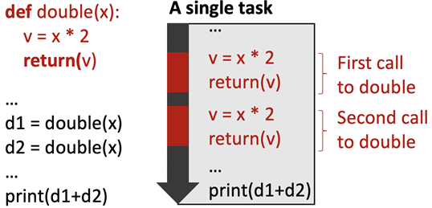
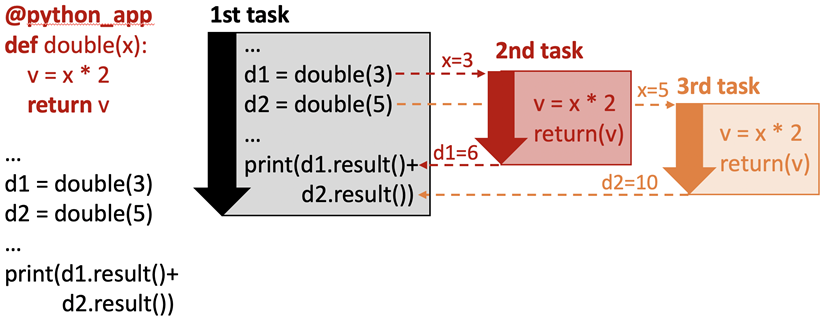
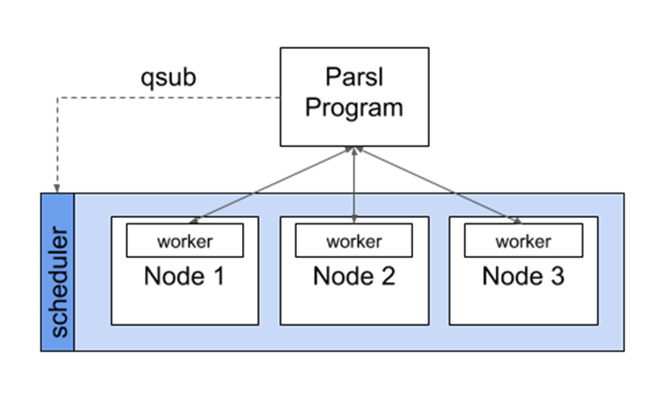
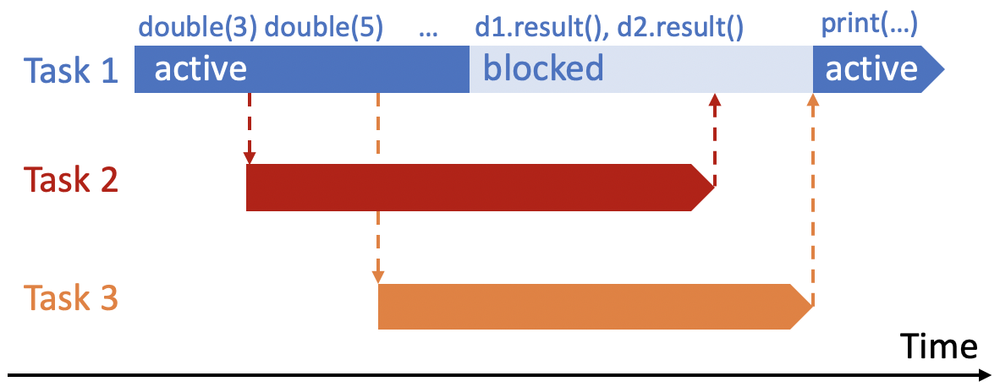
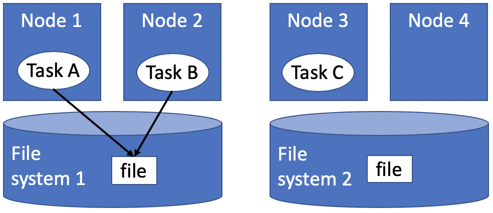

Overview
========

Parsl is designed to enable straightforward parallelism and orchestration of asynchronous 
tasks into dataflow-based workflows, in Python. Parsl manages the concurrent execution of 
these tasks across various computation resources, from laptops to supercomputers,
scheduling each task only when its dependencies (e.g., input data dependencies) are met.

Developing a Parsl program is a two-step process:

1. Define Parsl apps by annotating Python functions to indicate that they can be executed concurrently.
2. Use standard Python code to invoke Parsl apps, creating asynchronous tasks and adhering to dependencies defined between apps.

We aim in this section to provide a mental model of how Parsl programs behave.
We discuss how Parsl programs create concurrent tasks, how tasks communicate,
and the nature of the environment on which Parsl programs can perform
operations. In each case, we compare and contrast the behavior of Python
programs that use Parsl constructs with those of conventional Python
programs.

.. note::
	The behavior of a Parsl program can vary in minor respects depending on the
	Executor used (see :ref:`label-execution`). We focus here on the behavior seen when
	using the recommended `HighThroughputExecutor` (HTEX).

Parsl and Concurrency
---------------------
Any call to a Parsl app creates a new task that executes concurrently with the
main program and any other task(s) that are currently executing. Different
tasks may execute on the same nodes or on different nodes, and on the same or
different computers. 

The Parsl execution model thus differs from the Python native execution model,
which is inherently sequential. A Python program that does not contain Parsl
constructs, or make use of other concurrency mechanisms, executes statements
one at a time, in the order that they appear in the program. This behavior is
illustrated in the following figure, which shows a Python program on the left
and, on the right, the statements executed over time when that program is run,
from top to bottom. Each time that the program calls a function, control passes
from the main program (in black) to the function (in red). Execution of the
main program resumes only after the function returns.

In contrast, the Parsl execution model is inherently concurrent. Whenever a
program calls an app, a separate thread of execution is created, and the main
program continues without pausing. Thus in the example shown in the figure
below. There is initially a single task: the main program (black). The first
call to ``double`` creates a second task (red) and the second call to ``double`` 
creates a third task (orange). The second and third task terminate as the
function that they execute returns. (The dashed lines represent the start and
finish of the tasks). The calling program will only block (wait) when it is
explicitly told to do so (in this case by calling ``result()``)

.. note::
	Note: We talk here about concurrency rather than parallelism for a reason.
	Two activities are concurrent if they can execute at the same time. Two
	activities occur in parallel if they do run at the same time. If a Parsl
	program creates more tasks that there are available processors, not all
	concurrent activities may run in parallel.

Parsl and Execution
-------------------
We have now seen that Parsl tasks are executed concurrently alongside the main
Python program and other Parsl tasks. We now turn to the question of how and
where are those tasks executed. Given the range of computers on which parallel
programs may be executed, Parsl allows tasks to be executed using different 
executors (:py:class:`parsl.executors`). Executors are responsible for taking a queue of tasks and executing 
them on local or remote resources.

We briefly describe two of Parsl's most commonly used executors. 
Other executors are described in :ref:`label-execution`.

The `HighThroughputExecutor` (HTEX) implements a *pilot job model* that enables 
fine-grain task execution using across one or more provisioned nodes. 
HTEX can be used on a single node (e.g., a laptop) and will make use of 
multiple processes for concurrent execution.
As shown in the following figure, HTEX uses Parsl's provider abstraction (:py:class:`parsl.providers`) to 
communicate with a resource manager (e.g., batch scheduler or cloud API) to 
provision a set of nodes (e.g., Parsl will use Slurm’s qsub command to request
nodes on a Slurm cluster) for the duration of execution. 
HTEX deploys a lightweight worker agent on the nodes which subsequently connects 
back to the main Parsl process. Parsl tasks are then sent from the main program 
to the connected workers for execution and the results are sent back via the 
same mechanism. This approach has a number of advantages over other methods: 
it avoids long job scheduler queue delays by acquiring one set of resources 
for the entire program and it allows for scheduling of many tasks on individual 
nodes. 

.. Note:
	Note: when deploying HTEX, or any pilot job model such as the
	WorkQueueExecutor, it is important that the worker nodes be able to connect
	back to the main Parsl process. Thus, you should verify that there is network
  connectivity between the workers and the Parsl process and ensure that the
	correct network address is used by the workers. Parsl provides a helper
	function to automatically detect network addresses 
	(`parsl.addresses.address_by_query`).

The `ThreadPoolExecutor` allows tasks to be executed on a pool of locally 
accessible threads. As execution occurs on the same computer, on a pool of 
threads forked from the main program, the tasks share memory with one another 
(this is discussed further in the following sections).

Parsl and Communication
-----------------------
Parsl tasks typically need to communicate in order to perform useful work.
Parsl provides for two forms of communication: by parameter passing
and by file passing. 
As described in the next section, Parsl programs may also communicate by
interacting with shared filesystems and services its environment. 

Parameter Passing
^^^^^^^^^^^^^^^^^

The figure above illustrates communication via parameter passing. 
The call ``double(3)`` to the app ``double`` in the main program creates a new task
and passes the parameter value, 3, to that new task. When the task completes
execution, its return value, 6, is returned to the main program. Similarly, the
second task is passed the value 5 and returns the value 10. In this case, the
parameters passed are simple primitive types (i.e., integers); however, complex
objects (e.g., Numpy Arrays, Pandas DataFrames, custom objects) can also be
passed to/from tasks.

File Passing
^^^^^^^^^^^^
Parsl supports communication via files in both Bash apps and Python apps. 
Files may be used in place of parameter passing for many reasons, such as for 
apps are designed to support files, when data to be exchanged are large, 
or when data cannot be easily serialized into Python objects. 
As Parsl tasks may be executed on remote nodes, without shared file systems, 
Parsl offers a Parsl :py:class:`parsl.data_provider.files.File` construct for location-independent reference 
to files. Parsl will translate file objects to worker-accessible paths
when executing dependent apps.
Parsl is also able to transfer files in, out, and between Parsl
apps using one of several methods (e.g., FTP, HTTP(S), Globus and rsync). 
To accommodate the asynchronous nature of file transfer, Parsl treats 
data movement like a Parsl app, adding a dependency to the execution graph
and waiting for transfers to complete before executing dependent apps. 
More information is provided in  :ref:`label-data`).

Futures
^^^^^^^
Communication via parameter and file passing also serves a second purpose, namely 
synchronization. As we discuss in more detail in :ref:`label-futures`, a call to an
app returns a special object called a future that has a special unassigned 
state until such time as the app returns, at which time it takes the return 
value. (In the example program, two futures are thus created, d1 and d2.) The
AppFuture function result() blocks until the future to which it is applied takes
a value. Thus the print statement in the main program blocks until both child
tasks created by the calls to the double app return. The following figure
captures this behavior, with time going from left to right rather than top to
bottom as in the preceding figure. Task 1 is initially active as it starts
Tasks 2 and 3, then blocks as a result of calls to d1.result() and d2.result(),
and when those values are available, is active again.

The Parsl Environment
---------------------
Regular Python and Parsl-enhanced Python differ in terms of the environment in
which code executes. We use the term *environment* here to refer to the 
variables and modules (the *memory environment*), the file system(s) 
(the *file system environment*), and the services (the *service environment*) 
that are accessible to a function.

An important question when it comes to understanding the behavior of Parsl 
programs is the environment in which this new task executes: does it have the 
same or different memory, file system, or service environment as its parent 
task or any other task? The answer, depends on the executor used, and (in the 
case of the file system environment) where the task executes. 
Below we describe behavior for the most commonly used `HighThroughputExecutor`
which is representative of all Parsl executors except the `ThreadPoolExecutor`.

.. Warning:
	The `ThreadPoolExecutor` behaves differently than other Parsl executors as
	it allows tasks to share memory.

Memory environment
^^^^^^^^^^^^^^^^^^ 

In Python, the variables and modules that are accessible to a function are defined 
by Python scoping rules, by which a function has access to both variables defined 
within the function (*local* variables) and those defined outside the function 
(*global* variables). Thus in the following code, the print statement in the 
print_answer function accesses the global variable "answer", and we see as output 
"the answer is 42."

.. code-block:: python

    answer = 42

    def print_answer():
        print('the answer is', answer)

    print_answer()

In Parsl (except when using the `ThreadPoolExecutor`) a Parsl app is executed
in a distinct environment that only has access to local variables associated 
with the app function. Thus, if the program above is executed with say the 
`HighThroughputExecutor`, will print "the answer is 0" rather than "the answer
is 42," because the print statement in provide_answer does not have access to 
the global variable that has been assigned the value 42.  The program will
run without errors when using the `ThreadPoolExecutor`.

Similarly, the same scoping rules apply to import statements, and thus 
the following program will run without errors with the `ThreadPoolExecutor`, 
but raise errors when run with any other executor, because the return statement 
in ``ambiguous_double`` refers to a variable (factor) and a module (random) that are 
not known to the function.

.. code-block:: python

    import random
    factor = 5

    @python_app
    def ambiguous_double(x):
        return x * random.random() * factor

    print(ambiguous_double(42))
 

To allow this program to run correctly with all Parsl executors, the random 
library must be imported within the app, and the factor variable must be
passed as an argument, as follows.

.. code-block:: python

    import random
    factor = 5

    @python_app
    def good_double(factor, x):
        import random
        return x * random.random() * factor

    print(good_double(factor, 42))

File system environment 
^^^^^^^^^^^^^^^^^^^^^^^

In a regular Python program the environment that is accessible to a Python 
program also includes the file system(s) of the computer on which it is 
executing. 
Thus in the following code, a value written to a file "answer.txt" in the
current directory can be retrieved by reading the same file, and the print
statement outputs "the answer is 42."

.. code-block:: python

    def print_answer_file():
        with open('answer.txt','r') as f:
            print('the answer is',  f.read())

    with open('answer.txt','w') as f:
        f.write('42')
        f.close()

    print_answer_file()

The question of which file system environment is accessible to a Parsl app
depends on where the app executes. If two tasks run on nodes that share a 
file system, then those tasks (e.g., tasks A and B in the figure below, 
but not task C) share a file system environment. Thus the program above will 
output "the answer is 42" if the parent task and the child task run on 
nodes 1 and 2, but not if they run on nodes 2 and 3.

Service Environment
^^^^^^^^^^^^^^^^^^^

We use the term service environment to refer to network services that may be
accessible to a Parsl program, such as a Redis server or Globus data management
service. These services are accessible to any task.

Environment Summary
^^^^^^^^^^^^^^^^^^^

As we summarize in the table, if tasks execute with the `ThreadPoolExecutor`, 
they share the memory and file system environment of the parent task. If they
execute with any other executor, they have a separate memory environment, and
may or may not share their file system environment with other tasks, depending
on where they are placed. All tasks typically have access to the same network
services.

+--------------------+--------------------+--------------------+---------------------------+------------------+
|                    | Share memory       | Share file system  | Share file system         | Share service    |
|                    | environment with   | environment with   | environment with other    | environment      |
|                    | parent/other tasks | parent             | tasks                     | with other tasks | 
+====================+====================+====================+===========================+==================+
+--------------------+--------------------+--------------------+---------------------------+------------------+
| Python             | Yes                | Yes                | N/A                       |     N/A          |
| without            |                    |                    |                           |                  |
| Parsl              |                    |                    |                           |                  |
+--------------------+--------------------+--------------------+---------------------------+------------------+
| Parsl              | Yes                | Yes                | Yes                       |     N/A          |
| ThreadPoolExecutor |                    |                    |                           |                  |
|                    |                    |                    |                           |                  |
+--------------------+--------------------+--------------------+---------------------------+------------------+
| Other Parsl        | No                 | If executed on the | If tasks are executed on  |     N/A          |
| executors          |                    | same node with     | the same node or with     |                  |
|                    |                    | file system access | access to the same file   |                  |
|                    |                    |                    | system                    |                  |
+--------------------+--------------------+--------------------+---------------------------+------------------+
