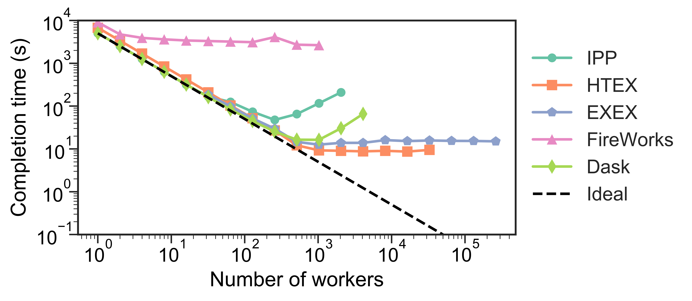
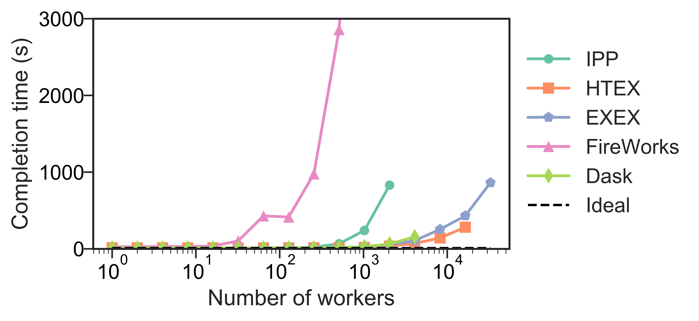

.. _label-performance:

Performance and Scalability
===========================

Parsl is designed to scale from small to large systems .

Scalability
-----------
We studied strong and weak scaling on the Blue Waters supercomputer. 
In strong scaling, the total problem size is fixed; in weak scaling, the problem
size per CPU core is fixed. In both cases, we measure completion
time as a function of number of CPU cores. An ideal framework
should scale linearly, which for strong scaling means that speedup
scales with the number of cores, and for weak scaling means that
completion time remains constant as the number of cores increases.

To measure the strong and weak scaling of Parsl executors, we
created Parsl programs to run tasks with different durations, ranging from a 
"no-op"--a Python function that exits immediately---to
tasks that sleep for 10, 100, and 1,000 ms. For each executor we
deployed a worker per core on each node.

While we compare here with IPP, Fireworks, and Dask Distributed, 
we note that these systems are not necessarily designed for 
Parsl-like workloads or scale. 

Further results are presented in our  
`HPDC paper <https://parsl-project.org/publications/babuji19parsl.pdf>`_.

Strong scaling
^^^^^^^^^^^^^^
The figures below show the strong scaling results for 5,000 1-second 
sleep tasks. HTEX
provides good performance in all cases, slightly exceeding what is
possible with EXEX, while EXEX scales to significantly more workers 
than the other executors and frameworks.  Both
HTEX and EXEX remain nearly constant, indicating that they likely
will continue to perform well at larger scales. 

Weak scaling
^^^^^^^^^^^^
Here, we launched 10 tasks per worker, while
increasing the number of workers. (We limited experiments to 10
tasks per worker, as on 3,125 nodes, that represents 3,125
nodes × 32 workers/node × 10 tasks/worker, or 1M tasks.) The
figure below shows our results. We observe that HTEX
and EXEX outperform other executors and frameworks with more
than 4,096 workers (128 nodes). All frameworks exhibit similar
trends, with completion time remaining close to constant initially
and increasing rapidly as the number of workers increases. 

Throughput
----------
We measured the maximum throughput of all the Parsl executors, 
on the UChicago Research Computing Center's Midway Cluster.
To do so, we ran 50,000 “no-op" tasks on a varying number of
workers and recorded the completion times. The throughout is
computed as the number of tasks divided by the completion time.
HTEX, and EXEX achieved maximum throughputs of 1,181 and 1,176 
tasks/s, respectively.

Summary
-------

The table below summarizes the scale at which we have tested Parsl executors.
The maximum number of nodes and workers for HTEX and EXEX is limited
by the size of allocation available during testing on Blue Waters. 
The throughput results are collected on Midway.

+-----------+------------------+-------------+------------------+
| Executor  | Max # workers    | Max # nodes | Max tasks/second |
+===========+==================+=============+==================+
| IPP       | 2,048            | 64          | 330              |
+-----------+------------------+-------------+------------------+
| HTEX      | 65,536           | 2,048       | 1,181            |
+-----------+------------------+-------------+------------------+
| EXEX      | 262,144          | 8,192       | 1,176            |
+-----------+------------------+-------------+------------------+
