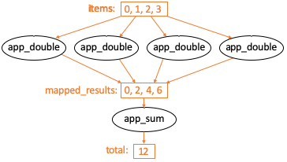

.. _label-workflow:

Example parallel patterns
=========================

Parsl can be used to implement a wide range of parallel programming patterns, from bag of tasks
through to nested workflows. Parsl implicitly assembles a dataflow
dependency graph based on the data shared between apps. 
The flexibility of this model allows for the implementation of a wide range 
of parallel programming and workflow patterns. 

Parsl is also designed to address broad execution requirements, from programs
that run many short tasks to those that run a few long tasks. 

Below we illustrate a range of parallel programming and workflow patterns. It is important 
to note that this set of examples is by no means comprehensive.

Bag of Tasks
------------
Parsl can be used to execute a large bag of tasks.  In this case, Parsl
assembles the set of tasks (represented as Parsl apps) and manages their concurrent
execution on available resources. 

.. code-block:: python

    from parsl import python_app
    
    parsl.load()

    # Map function that returns double the input integer
    @python_app
    def app_random():
        import random
        return random.random()

    results =  []
    for i in range(0, 10):
        x = app_random()
        mapped_results.append(x)

    for r in results: 
        print(r.result())

Sequential workflows
--------------------

Sequential workflows can be created by passing an AppFuture from one task to another. For example, in the following program the ``generate`` app (a Python app) generates a random number that is consumed by the ``save`` app (a Bash app), which writes it to a file. Because ``save`` cannot execute until it receives the ``message`` produced by ``generate``, the two apps execute in sequence.

.. code-block:: python

      from parsl import python_app
    
      parsl.load()
		
      # Generate a random number
      @python_app
      def generate(limit):
            from random import randint
            """Generate a random integer and return it"""
            return randint(1,limit)

      # Write a message to a file
      @bash_app
      def save(message, outputs=[]):
            return 'echo {} &> {}'.format(message, outputs[0])

      message = generate(10)

      saved = save(message, outputs=['output.txt'])

      with open(saved.outputs[0].result(), 'r') as f:
            print(f.read())

Parallel workflows
------------------

Parallel execution occurs automatically in Parsl, respecting dependencies among app executions. In the following example, three instances of the ``wait_sleep_double`` app are created. The first two execute concurrently, as they have no dependencies; the third must wait until the first two complete and thus the ``doubled_x`` and ``doubled_y`` futures have values. Note that this sequencing occurs even though ``wait_sleep_double`` does not in fact use its second and third arguments.

.. code-block:: python
      
      from parsl import python_app

      parsl.load()
			
      @python_app
      def wait_sleep_double(x, foo_1, foo_2):
           import time
           time.sleep(2)   # Sleep for 2 seconds
           return x*2

      # Launch two apps, which will execute in parallel, since they do not have to
      # wait on any futures
      doubled_x = wait_sleep_double(10, None, None)
      doubled_y = wait_sleep_double(10, None, None)

      # The third app depends on the first two:
      #    doubled_x   doubled_y     (2 s)
      #           \     /
      #           doublex_z          (2 s)
      doubled_z = wait_sleep_double(10, doubled_x, doubled_y)

      # doubled_z will be done in ~4s
      print(doubled_z.result())

Parallel workflows with loops
-----------------------------

A common approach to executing Parsl apps in parallel is via loops. The following example uses a loop to create many random numbers in parallel.

.. code-block:: python

    from parsl import python_app
    
    parsl.load()
			
    @python_app
    def generate(limit):
        from random import randint
        """Generate a random integer and return it"""
        return randint(1, limit)

    rand_nums = []
    for i in range(1,5):
        rand_nums.append(generate(i))

    # Wait for all apps to finish and collect the results
    outputs = [r.result() for r in rand_nums]

In the preceding example, the execution of different tasks is coordinated by passing Python objects from producers to consumers. In other cases, it can be convenient to pass data in files, as in the following reformulation. Here, a set of files, each with a random number, is created by the ``generate`` app. These files are then concatenated into a single file, which is subsequently used to compute the sum of all numbers. 

.. code-block:: python

      from parsl import python_app, bash_app
    
      parsl.load()
			
      @bash_app
      def generate(outputs=[]):
          return 'echo $(( RANDOM % (10 - 5 + 1 ) + 5 )) &> {}'.format(outputs[0])

      @bash_app
      def concat(inputs=[], outputs=[], stdout='stdout.txt', stderr='stderr.txt'):
          return 'cat {0} >> {1}'.format(' '.join(inputs), outputs[0])

      @python_app
      def total(inputs=[]):
          total = 0
          with open(inputs[0].filepath, 'r') as f:
              for l in f:
                  total += int(l)
          return total

      # Create 5 files with random numbers
      output_files = []
      for i in range (5):
           output_files.append(generate(outputs=['random-%s.txt' % i]))

      # Concatenate the files into a single file
      cc = concat(inputs=[i.outputs[0] for i in output_files], outputs=['all.txt'])

      # Calculate the average of the random numbers
      totals = total(inputs=[cc.outputs[0]])

      print(totals.result())

MapReduce
---------
MapReduce is a common pattern used in data analytics. It is composed of a map phase
that filters values and a reduce phase that aggregates values.
The following example demonstrates how Parsl can be used to specify a MapReduce computation
in which the map phase doubles a set of input integers and the reduce phase computes
the sum of those results.

.. code-block:: python

    from parsl import python_app
    
    parsl.load()

    # Map function that returns double the input integer
    @python_app
    def app_double(x):
        return x*2

    # Reduce function that returns the sum of a list
    @python_app
    def app_sum(inputs=[]):
        return sum(inputs)

    # Create a list of integers
    items = range(0,4)

    # Map phase: apply the double *app* function to each item in list
    mapped_results = []
    for i in items:
        x = app_double(i)
        mapped_results.append(x)

    # Reduce phase: apply the sum *app* function to the set of results
    total = app_sum(inputs=mapped_results)

    print(total.result())

The program first defines two Parsl apps, ``app_double`` and ``app_sum``.
It then makes calls to the ``app_double`` app with a set of input
values. It then passes the results from ``app_double`` to the ``app_sum`` app
to aggregate values into a single result. 
These tasks execute concurrently, synchronized  by the ``mapped_results`` variable.
The following figure shows the resulting task graph. 

